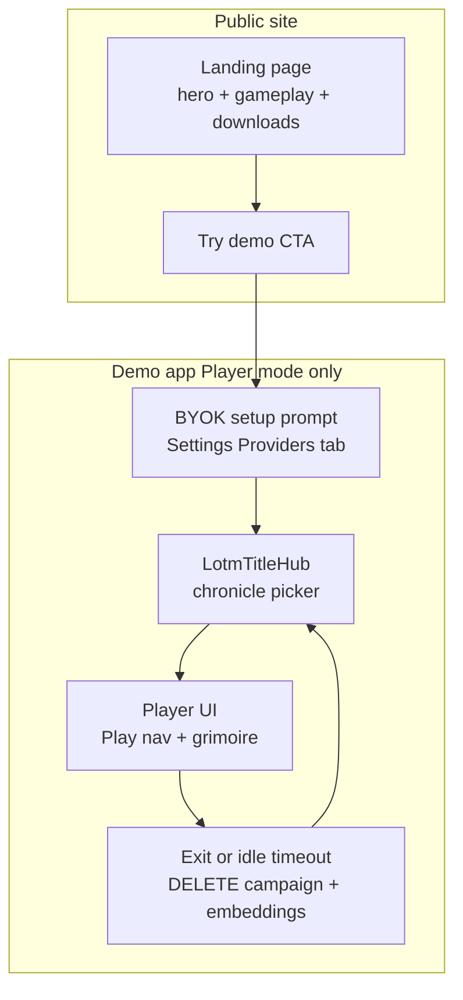
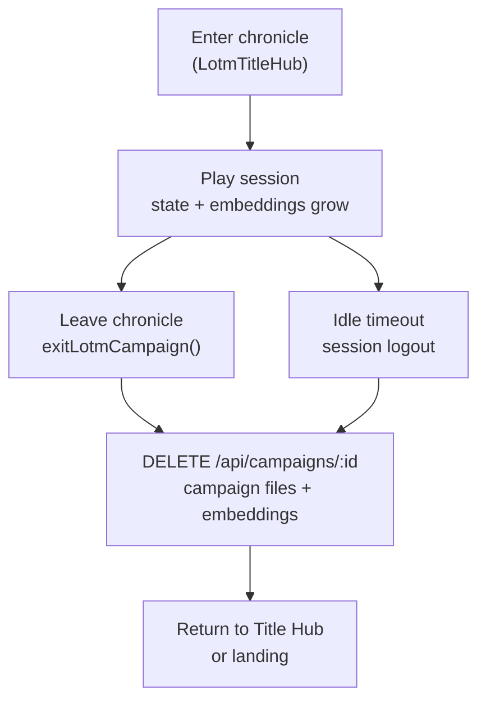
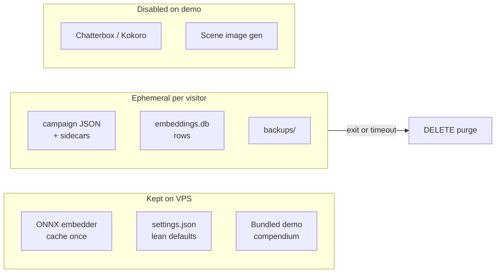

# Demo VPS Player Deployment Guide

- **Audience:** Developers, operators, and AI agents deploying a public LOTM demo.
- **Goal:** Ship a Player-view-only production demo on a VPS with a marketing landing page and BYOK onboarding — grounded in the real codebase, not generic hosting advice.
- **Sister docs:**
  - [ui-view-modes.md](./ui-view-modes.md) — Player vs GM mode behavior
  - [lotm-how-to-play-guide.md](./lotm-how-to-play-guide.md) — Gameplay content for landing page copy
  - [COOLIFY.md](../COOLIFY.md) — Existing VPS deploy path
  - [monetization-and-deployment.md](./monetization-and-deployment.md) — Electron packaging backlog

---


## 1. Target Experience (What Production Should Look Like)




### User journey

1. **Visitor lands on marketing page** — hero, 3–4 gameplay bullets sourced from `[LotmHowToPlayGuide.tsx](../../src/components/lotm/LotmHowToPlayGuide.tsx)` sections: Acting Method, Spiritual Actions/Dice, Mystical Harvest.
2. **CTA links to demo app route** — e.g. `/app` or a dedicated subdomain (see §2).
3. **First visit: BYOK setup** — modal or banner prompting API key setup (Providers tab). Keys stay in browser IndexedDB + optional vault (`[VaultUnlockModal.tsx](../../src/components/VaultUnlockModal.tsx)`); the server never stores visitor API keys unless the operator bundles AI later (see [monetization-and-deployment.md](./monetization-and-deployment.md) Model G).
4. **Player enters chronicle** via `[LotmTitleHub.tsx](../../src/components/lotm/LotmTitleHub.tsx)` — one ephemeral session per visit; no TTS playback (Chatterbox and Kokoro disabled server-side).
5. **UI locked to Player view** — no GM toggle, no World/Engine/Mods nav (`[ContextNavigationDrawer.tsx](../../src/components/ContextNavigationDrawer.tsx)`, `[SettingsModal.tsx](../../src/components/SettingsModal.tsx)`).
6. **Leaving chronicle or idle timeout** — campaign JSON, vector embeddings, backups, and scene images for that session are deleted; visitor returns to Title Hub or landing.
7. **Future:** Landing page “Download” section with Windows/macOS/Linux Electron builds (not in repo today — see [monetization-and-deployment.md](./monetization-and-deployment.md) Model A).

---


## 2. Routing Options

Document all three approaches; use **Approach A** as the phased default.


| Approach                         | Landing                     | Demo app               | Pros                             | Cons                                                                          |
| -------------------------------- | --------------------------- | ---------------------- | -------------------------------- | ----------------------------------------------------------------------------- |
| **A — Path split (recommended)** | `/` static or React landing | `/app` SPA             | One Coolify resource, one domain | Requires `[server.js](../../server.js)` routing + Vite `base` or react-router |
| **B — Subdomain split**          | `lotmdnd.work.gd`           | `demo.lotmdnd.work.gd` | Clean separation                 | Two Coolify resources; copy [COOLIFY.md](../COOLIFY.md) twice                 |
| **C — SPA-only**                 | React route `/`             | React route `/demo`    | No server routing change         | Larger bundle; marketing page tied to app release                             |


### Current behavior

In production, `[server.js](../../server.js)` (lines 167–183) serves `dist/index.html` for all non-API GET paths — there is **no landing page or route split today**:

```js
// Production web: serve the Vite build from the same origin as /api
if (process.env.NODE_ENV === 'production' && fs.existsSync(DIST_DIR)) {
    app.use(express.static(DIST_DIR, { index: false, maxAge: '1h' }));
    app.use((req, res, next) => {
        // ... skip /api, /assets, /health ...
        res.sendFile(path.join(DIST_DIR, 'index.html'), ...);
    });
}
```

`[vite.config.ts](../../vite.config.ts)` uses `base: './'` (Electron-friendly). Changing to `/app/` affects asset paths and must be coordinated with static serving and any react-router basename.

---


## 3. Player-Only Enforcement

Demo builds (`VITE_DEPLOYMENT_MODE=demo` / `npm run dev -- --demo`) lock Player view and hide Settings. Server `DEMO_MODE=1` or `node server.js --demo` skips TTS warmup, blocks scene-image generation, and enables session purge.

See [ui-view-modes.md](./ui-view-modes.md) for the existing Player mode contract. Demo goes further: **no Settings chrome**, AI tier locked to `lite`, BYOK via `[DemoOnboardingModal.tsx](../../src/components/demo/DemoOnboardingModal.tsx)`.

### Local preview

```bash
npm run dev -- --demo
# or
npm run dev:demo
```

Local demo image:

```bash
docker compose -f docker-compose.yml -f docker-compose.demo.yml up --build
```

VPS / Coolify uses `[docker-compose.prod.yml](../../docker-compose.prod.yml)` (pull-only). That file sets `DEMO_MODE=1`; GitHub Actions bakes `VITE_DEPLOYMENT_MODE=demo` into the GHCR image. Runtime env **cannot** turn a full-app image into Player-only — rebuild and pull after changing the build arg.

The Vite demo flag is a **build-time** alias: lore/loot/item catalog resolve to `demo_world_lore_lord_of_the_mysteries.md`, `demo_loot.json`, and `demo_item_catalog.json`.


### Wired work


| Task                              | Touch points                                                                                                                                                                                                                                         |
| --------------------------------- | ---------------------------------------------------------------------------------------------------------------------------------------------------------------------------------------------------------------------------------------------------- |
| Build-time demo flag              | `VITE_DEPLOYMENT_MODE=demo` — `[vite.config.ts](../../vite.config.ts)`, `[.env.demo](../../.env.demo)`, Dockerfile `ARG`, `npm run build:demo`                                                                                                        |
| Lock view mode                    | `[demoMode.ts](../../src/config/demoMode.ts)` `applyDemoLocks` — `uiViewMode: 'player'`, ignore GM updates                                                                                                                                           |
| Hide settings                     | `[SettingsModal.tsx](../../src/components/SettingsModal.tsx)` unmounts; Title Hub gear becomes API-key BYOK                                                                                                                                          |
| Hide director injectors           | `[ContextNavigationDrawer.tsx](../../src/components/ContextNavigationDrawer.tsx)` omits Inject Arc/Event/Absolute Command                                                                                                                            |
| BYOK onboarding modal             | `[DemoOnboardingModal.tsx](../../src/components/demo/DemoOnboardingModal.tsx)`                                                                                                                                                                        |
| Disable TTS on demo               | Skip `warmupTts()` in `[server.js](../../server.js)` when `DEMO_MODE=1` / `TTS_DISABLED`; `ttsEnabled` locked false                                                                                                                                  |
| Delete chronicle on exit          | `[exitLotmCampaign()](../../src/components/lotm/LotmPlayHeader.tsx)` → `deleteCampaign(id)`                                                                                                                                                           |
| Session idle timeout              | `[DemoSessionGuard.tsx](../../src/components/demo/DemoSessionGuard.tsx)` + `[DELETE /api/demo/session/:id](../../server/routes/demoSession.js)` — 45 min idle, 5 min warning                                                                          |
| Demo world pack                   | Aliases in `[vite.config.ts](../../vite.config.ts)` + 4 starter PCs in `[demoMode.ts](../../src/config/demoMode.ts)`                                                                                                                                  |


---


## 4. Ephemeral Data Lifecycle (Critical Policy)

**No auth exists.** All campaigns live in one `lotm-data` volume (`[docker-compose.yml](../../docker-compose.yml)`). The demo **must not accumulate** visitor data on disk.




### 4.1 Delete chronicle when leaving

Today `[exitLotmCampaign()](../../src/components/lotm/LotmPlayHeader.tsx)` saves state and calls `setActiveCampaign(null)` but **does not delete** the campaign. Demo must add:

1. Final state flush (already done).
2. `await deleteCampaign(activeCampaignId)` — removes all files matched by `[campaignFiles(id)](../../server/lib/fileStore.js)` under `data/campaigns/` and calls `[deleteCampaignEmbeddings(id)](../../server/lib/vectorStore.js)`.
3. Refresh Title Hub list so the chronicle does not reappear.

Also wire the same delete into `[Header.tsx](../../src/components/Header.tsx)` “back to hub” path if it bypasses `exitLotmCampaign`.

Show a one-line banner on Title Hub: *“Demo sessions are temporary — your chronicle is removed when you leave.”*

### 4.2 Timer-based session logout

No server-side sessions exist today. Recommended demo pattern:


| Piece            | Approach                                                                                                                                                        |
| ---------------- | --------------------------------------------------------------------------------------------------------------------------------------------------------------- |
| Session identity | On first demo app load, generate `demoSessionId` (UUID in `sessionStorage` + optional HttpOnly cookie for server-side purge API)                                |
| Tag campaigns    | Pass `demoSessionId` in campaign metadata on create (`[createLotmCampaign](../../src/services/lotm/createLotmCampaign.ts)`)                                     |
| Idle detection   | Client `setInterval` / `visibilitychange` — reset timer on input; default **45 min idle** (configurable via `VITE_DEMO_IDLE_MS`)                                |
| Warning          | Modal at T−5 min: “Session expiring — export not available on demo”                                                                                             |
| Logout           | Clear Zustand store, IndexedDB settings optional (keep BYOK keys), call `DELETE /api/demo/session/:id` or iterate tagged campaign IDs                           |
| Server purge     | New route lists campaigns with matching `demoSessionId` metadata field and deletes each; also prune `data/backups/` and `data/portraits/` entries for those IDs |


On logout, accumulated data removed includes: `.json` / `.state.json` / ledger sidecars, `[embeddings.db](../../server/lib/vectorStore.js)` rows, auto-backups in `[BACKUPS_DIR](../../server/lib/fileStore.js)`, and any scene images written under campaign-scoped paths.

BYOK provider keys stay in browser IndexedDB unless the operator chooses to clear them on logout (default: **retain keys**, purge server data only).

### 4.3 Demo-trimmed world compendium

Full LOTM pack ships **22 playable PCs** and full geography/grimoire catalogs via `[lordOfTheMysteries.ts](../../src/worldpacks/lordOfTheMysteries.ts)` (`import.meta.glob` on `mechanics/World_compendium/.../people/lotm_pc_*.json`) plus large `[gamedata/](../../gamedata/)` trees consumed by `[lotmGrimoireCatalog.ts](../../src/worldpacks/lotmGrimoireCatalog.ts)`, `[lotmGeography.ts](../../src/worldpacks/lotmGeography.ts)`, etc.

For demo, ship a **smaller build artifact**:


| Trim target      | Full app                                                                                   | Demo recommendation                                               |
| ---------------- | ------------------------------------------------------------------------------------------ | ----------------------------------------------------------------- |
| Playable PCs     | 22 (`lotm_pc_*.json`)                                                                      | **3–4** starters (e.g. Clara, one combat, one divination pathway) |
| World lore MD    | Full `world_lore_lord_of_the_mysteries.md`                                                 | Abbreviated demo lore (~30–50% length) or single-city focus       |
| Map pins         | Full `[lotm_map_pins.json](../../gamedata/assets/data/world/Geography/lotm_map_pins.json)` | Subset: Tingen + immediate region only                            |
| Grimoire volumes | All `lotm_vol_*.json`                                                                      | Vol 1 excerpts only                                               |
| Item lists       | Full sealed-artefact grades                                                                | Sequence 9–7 loot tables only                                     |


Implementation options:

- **Build-time:** `VITE_DEPLOYMENT_MODE=demo` aliases imports in `[vite.config.ts](../../vite.config.ts)` to `demo_world_lore_lord_of_the_mysteries.md`, `demo_loot.json`, and `demo_item_catalog.json` in `mechanics/World_compendium/Lord of the Mysteries/`. Starter PCs are filtered to Clara, Jacob, Edmund, and Arthur.
- **Runtime flag:** Server serves demo pack files from `gamedata-demo/` — higher ops complexity; prefer build-time split for smaller Docker image.

Smaller compendium reduces **image bundle size**, **prompt token load** (less lore injected per turn), and **embedding index size** when lore chunks are indexed.

### 4.4 Fallback ops reset

Even with client-side delete hooks, run a nightly cron on the VPS that deletes any campaign older than 24 h in `data/campaigns/` (belt-and-braces against tab-kill / network failure). Document in Coolify resource post-deploy commands.

---


## 5. VPS Deployment Steps (Operator Runbook)

Reuse the existing stack from [COOLIFY.md](../COOLIFY.md).

### 5.1 DNS

A record for demo domain (or reuse `lotmdnd.work.gd`).

### 5.2 VPS sizing

- **2 GB RAM** — sufficient for demo (no Chatterbox TTS sidecar, default `aiTier: lite`)
- Do **not** enable Chatterbox TTS on demo — it adds RAM, CPU, model storage, and audio cache under `data/` (`[server/lib/tts/](../../server/lib/tts/)`, `[warmupTts()](../../server.js)` line 108)
- First deploy still downloads the **ONNX embedder** to `data/.embeddings_cache` (~hundreds of MB one-time); this is required for semantic recall unless demo disables embedding entirely (not recommended — breaks condenser/lore search)


### 5.3 Coolify resource

- Docker Compose from `[docker-compose.prod.yml](../../docker-compose.prod.yml)` (pull-only; already sets `DEMO_MODE=1` and `TTS_DISABLED=1`)
- Do **not** point Coolify at `[docker-compose.yml](../../docker-compose.yml)` — that file is the local full app and has `build: .`
- Container port **3001**
- Persistent `lotm-data` volume → `/app/data`


### 5.4 Environment variables

Extend the [COOLIFY.md](../COOLIFY.md) env table:


| Key                    | Demo value                                                             |
| ---------------------- | ---------------------------------------------------------------------- |
| `PUBLIC_ORIGIN`        | `https://<demo-domain>`                                                |
| `ALLOWED_ORIGINS`      | same                                                                   |
| `NODE_ENV`             | `production`                                                           |
| `DEMO_MODE`            | `1` — skip TTS warmup, seed lean defaults, enable session purge routes |
| `VITE_DEPLOYMENT_MODE` | `demo` — **CI build-arg only** (`deploy.yml` → Dockerfile `ARG`). Setting this in Coolify does not rebuild `dist/`. |
| `VITE_DEMO_IDLE_MS`    | `2700000` (45 min) — client session timeout                            |
| `TTS_DISABLED`         | `1` (optional explicit guard alongside `DEMO_MODE`)                    |


### 5.5 CI

`[deploy.yml](../../.github/workflows/deploy.yml)` builds GHCR `:latest` on push to `main` with `VITE_DEPLOYMENT_MODE=demo` — the VPS at `lotmdnd.work.gd` **is** the public demo. A separate `demo-latest` tag is only needed if you later publish a full-app image alongside it.

### 5.6 Proxy timeout

Raise read timeout to **300s+** for LLM streams ([COOLIFY.md](../COOLIFY.md) §6).

### 5.7 Smoke test

1. `GET /health` → `{"ok":true,"demo":true,"frontend":"demo"}`
2. Open landing page
3. Enter demo app route
4. Configure OpenRouter or Ollama key in Settings → Providers
5. Run one turn in a new chronicle
6. Exit to Title Hub — confirm chronicle no longer listed (`GET /api/campaigns` returns `[]` or only other sessions' data)
7. Confirm TTS speak button absent or disabled; no Chatterbox sidecar in container logs

---


## 6. Lean Operations (Storage, CPU, RAM)

Recommendations grounded in how the app actually spends resources:


| Lever                      | Default app behavior                                                                          | Demo setting                                                                                         | Savings                                             |
| -------------------------- | --------------------------------------------------------------------------------------------- | ---------------------------------------------------------------------------------------------------- | --------------------------------------------------- |
| **TTS**                    | `[warmupTts()](../../server.js)` on boot; Kokoro + Chatterbox providers                       | **Off** — skip warmup, hide speak controls                                                           | RAM, CPU, disk (audio cache)                        |
| **AI tier**                | User cycles lite → pro → max (`[aiTier.ts](../../src/services/turn/aiTier.ts)`)               | Lock `lite` — fewer background stages per turn                                                       | CPU + LLM tokens (user-paid BYOK, but faster turns) |
| **Scene images**           | `[createSceneImagesRouter](../../server/routes/sceneImages.js)` writes generated images       | Disable UI + block route when `DEMO_MODE=1`                                                          | Disk under `data/portraits/` and campaign assets    |
| **Auto-backups**           | Interval backups to `[data/backups/](../../server/lib/fileStore.js)`                          | Disable in demo (`autoBackupTimer` in `[campaignSlice.ts](../../src/store/slices/campaignSlice.ts)`) | Disk — pointless for ephemeral campaigns            |
| **Campaign export/import** | `[transfer.js](../../server/routes/transfer.js)`                                              | Hide import; export optional read-only snapshot before delete                                        | Prevents bulk data upload                           |
| **Mods**                   | Bundled + user mods in `data/mods/`                                                           | Ship read-only bundled mods only; disable install/upload                                             | Disk + boot CPU (`registerModTablesAtBoot`)         |
| **Embedding index**        | Grows with lore chunks per campaign (`[storeLoreEmbedding](../../server/lib/vectorStore.js)`) | Ephemeral delete on exit keeps `embeddings.db` small; optional cap lore chunks indexed per turn      | Disk + embed CPU                                    |
| **Condenser / archive**    | Long sessions append archive chapters                                                         | Demo sessions short; delete-on-exit prevents unbounded `.archive.json` growth                        | Disk                                                |
| **Debug payloads**         | Stripped on save (`[campaignStore.ts](../../src/store/campaignStore.ts)`)                     | Keep strip; disable Debug settings tab (Player mode already hides it)                                | Disk                                                |
| **Grimoire / gamedata**    | Full catalogs loaded at build time                                                            | Demo-trimmed pack (§4.3)                                                                             | Image + JS bundle size, prompt tokens               |
| **Concurrent users**       | Single Node process, sync file I/O                                                            | Rate-limit campaign create (e.g. 1 active session / IP / hour) optional middleware                   | CPU + disk spikes                                   |
| **Docker image**           | Full `gamedata/` + `mechanics/`                                                               | Multi-stage build with `demo` target excluding trimmed assets                                        | Pull size, disk                                     |


### Resource flow (demo)




### Monitoring

- Watch `lotm-data` volume size in Coolify; alert if > 500 MB (signals failed purge).
- Log `[API] Returning N campaigns` from `[campaigns.js](../../server/routes/campaigns.js)` — N should stay near 0 between sessions.

---


## 7. Landing Page Content Outline

Sections for implementers (copy can lift from existing docs):


| Section                | Content                                                                                                                       |
| ---------------------- | ----------------------------------------------------------------------------------------------------------------------------- |
| **Hero**               | “Lord of the Mysteries — AI narrative RPG”; CTA “Try the demo”                                                                |
| **How it plays**       | 3 cards: Acting Method / Dice & SPI / Loot & sequences (from [lotm-how-to-play-guide.md](./lotm-how-to-play-guide.md) §1–3)   |
| **BYOK callout**       | “Bring your own API key (OpenRouter, OpenAI, Ollama)” — keys stay in your browser; demo chronicles are deleted when you leave |
| **Self-host**          | Link to [README.md](../../README.md) clone instructions                                                                       |
| **Downloads (future)** | Placeholder cards for Windows / macOS / Linux Electron; link to GitHub Releases when `electron-builder` pipeline exists       |
| **Footer**             | Discord, MIT license, fan-content disclaimer for LOTM IP                                                                      |


### Implementation options


| Option      | Location                                   | Notes                                                                          |
| ----------- | ------------------------------------------ | ------------------------------------------------------------------------------ |
| Static HTML | `public/landing/index.html`                | Served before SPA catch-all in `[server.js](../../server.js)`; smallest bundle |
| React page  | `src/pages/LandingPage.tsx` + react-router | Shared styling; tied to app release cycle                                      |


---


## 8. Future Electron Downloads

Outline from [monetization-and-deployment.md](./monetization-and-deployment.md) Model A:

- `electron/` directory + `electron-builder` in `[package.json](../../package.json)`
- CI job: build artifacts → GitHub Releases or `public/downloads/`
- Landing page polls release API or static manifest `downloads.json`
- Hooks already exist in `[apiBase.ts](../../src/lib/apiBase.ts)` for `file://` protocol

Do not promise Electron downloads on the landing page until the CI pipeline ships.

---


## 9. Implementation Pointer Table (for Agents)


| Feature         | Likely files                                                                                                                                                            |
| --------------- | ----------------------------------------------------------------------------------------------------------------------------------------------------------------------- |
| Landing page    | `public/landing/index.html` or `src/pages/LandingPage.tsx`, `[server.js](../../server.js)` route order                                                                  |
| Demo route      | react-router in `[main.tsx](../../src/main.tsx)` or path prefix `/app`                                                                                                  |
| Player lock     | `[settingsHelpers.ts](../../src/store/slices/settingsHelpers.ts)`, `[SettingsModal.tsx](../../src/components/SettingsModal.tsx)`                                        |
| BYOK gate       | New modal + `[ProvidersTab.tsx](../../src/components/settings-modal/ProvidersTab.tsx)`                                                                                  |
| Delete on exit  | `[exitLotmCampaign()](../../src/components/lotm/LotmPlayHeader.tsx)`, `[deleteCampaign](../../src/store/campaignStore.ts)`                                              |
| Session timeout | New `useDemoSession.ts` hook + `server/routes/demoSession.js`                                                                                                           |
| TTS off         | `[server.js](../../server.js)` (`warmupTts`), `[settingsHelpers.ts](../../src/store/slices/settingsHelpers.ts)` defaults                                                |
| Demo compendium | `mechanics/World_compendium/Demo/`, `[lordOfTheMysteries.ts](../../src/worldpacks/lordOfTheMysteries.ts)`, trimmed `gamedata-demo/`                                     |
| Lean defaults   | `[settingsHelpers.ts](../../src/store/slices/settingsHelpers.ts)` (`aiTier`, `ttsEnabled`), `[campaignSlice.ts](../../src/store/slices/campaignSlice.ts)` (auto-backup) |
| Demo CI image   | `[Dockerfile](../../Dockerfile)` `VITE_DEPLOYMENT_MODE` ARG, `[deploy.yml](../../.github/workflows/deploy.yml)` (`demo` build-arg), `[docker-compose.prod.yml](../../docker-compose.prod.yml)` runtime `DEMO_MODE` |


---


## 10. What NOT to Do

- Do not expose GM view on public demo. Hide settings altogether. Keep ai tier on lite 
- Do not enable Chatterbox TTS on demo hosting — cost and storage with no Player-mode requirement.
- Do not retain chronicles after the visitor leaves or times out — disk will grow without bound on a shared volume.
- Do not store visitor API keys server-side for BYOK demo.
- Do not ship the full gamedata compendium if a trimmed demo build is available.
- Do not promise Electron downloads until CI pipeline ships.

---


## 11. Out of Scope for This Guide

- Marketing landing page / `/` vs `/app` path split (Approach A in §2) — demo currently is the SPA itself
- Electron CI and auth
- Legal advice on LOTM fan content — see [monetization-and-deployment.md](./monetization-and-deployment.md) §6

