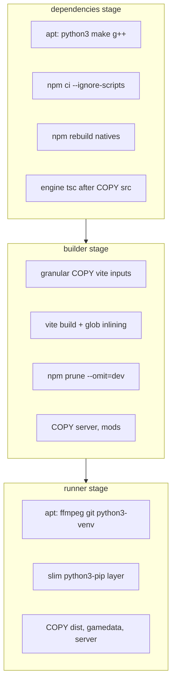

# Docker Build Performance

- **Audience:** Developers, operators, and AI agents tuning CI or local Docker builds.
- **Goal:** Explain why image builds are slow, which Dockerfile layers are expensive, and how to speed them up without breaking deploy.
- **Sister docs:**
  - [COOLIFY.md](../COOLIFY.md) — VPS deploy, GHCR pull, Coolify resource setup
  - [demo-vps-player-deployment.md](./demo-vps-player-deployment.md) — demo build args and lean deploy
  - [monetization-and-deployment.md](./monetization-and-deployment.md) — operator cost baseline
  - [docker-build.md](../errors/docker-build.md) — past `tsc: not found` failure during image build

---

## 1. Build Pipeline Overview

The image is a three-stage build defined in [`Dockerfile`](../../Dockerfile):

| Stage | Purpose | Typical cost (warm cache) | Typical cost (cold cache) |
| --- | --- | --- | --- |
| `dependencies` | Install build tools, `npm ci`, compile native addons, engine `tsc` | ~10–30 s (cache hit) | **3–8 min** |
| `builder` | Vite production build, `npm prune` | **1–4 min** | **2–5 min** |
| `runner` | Runtime `apt-get`, copy artifacts | ~10–20 s (cache hit) | ~30–60 s |

**Total (rough):** ~2–5 min on a warm GHA cache; **8–15 min** on a full cold build.

Production deploys use GitHub Actions ([`.github/workflows/deploy.yml`](../../.github/workflows/deploy.yml)) to build and push to GHCR. The VPS pulls the prebuilt image — it does not compile native modules locally. Slowness is most noticeable on:

- First build or GHA cache eviction
- `package-lock.json` changes (invalidates `npm ci`)
- Vite input changes (`src/`, `mechanics/`, `gamedata/`, `public/`) — invalidates the Vite layer, not `npm ci`
- Local `docker compose up --build` without GHA cache



---

## 2. Bottleneck Table (ranked by impact)

| Rank | Bottleneck | Where | Why it hurts |
| --- | --- | --- | --- |
| 1 | Native module install/compile | `dependencies` `npm ci` + `npm rebuild` | `better-sqlite3` and `sqlite-vec` compile via node-gyp; `@huggingface/transformers` pulls `onnxruntime-node` (~large binary). Local `node_modules` is ~1.1 GB. |
| 2 | Vite production build | `builder` | Bundles React 19, PixiJS 8, Transformers.js tokenizer, and eager `import.meta.glob` compendium inlining from [`src/worldpacks/`](../../src/worldpacks/). |
| 3 | `npm prune --omit=dev` | `builder` | Re-walks the full dependency tree after Vite (~30–60 s). |
| 4 | Runner `apt-get` | `runner` | Installs `ffmpeg`, `python3-venv`, `git`, plus a slim `python3-pip` layer for TTS/Chatterbox (~30–60 s on cache miss). |
| 5 | Coolify double-build (ops) | Coolify UI | Auto Deploy on git push + GHCR webhook can make the VPS rebuild **and** pull — doubles perceived deploy time. |

Engine source used to sit **before** `npm ci`, so any `packages/engine/src/**` edit forced a full native reinstall. That is fixed: lockfile layers are independent of engine source (see §3).

### Heavy Vite output (observed `dist/`)

| Asset | Size (approx.) |
| --- | --- |
| `dist/assets/textures/` | 9.7 MB |
| `dist/assets/tilesets/` | 7.9 MB |
| `dist/assets/tokenizer-*.js` | 5.3 MB |
| `dist/assets/index-*.js` | 2.7 MB |
| Compendium chunks (pathways, etc.) | 1–2 MB each |

Compendium data is inlined at build time via eager globs in [`lordOfTheMysteries.ts`](../../src/worldpacks/lordOfTheMysteries.ts), [`lotmGrimoireCatalog.ts`](../../src/worldpacks/lotmGrimoireCatalog.ts), [`lotmPathways.ts`](../../src/worldpacks/lotmPathways.ts).

---

## 3. Cache Invalidation Map

What file changes bust which Docker layer:

| Change | Layer invalidated | Effect |
| --- | --- | --- |
| `package.json` or `package-lock.json` | `dependencies` `npm ci` | Full native reinstall |
| `packages/engine/package.json` / `tsconfig.json` | `dependencies` `npm ci` | Full reinstall |
| `packages/engine/src/**` | Engine `tsc` only (after `npm ci`) | Recompile engine; **does not** reinstall natives |
| Vite inputs (`src/`, `mechanics/`, `gamedata/`, `public/`, `vite.config.ts`, `docs/MODDING.md`) | `builder` Vite RUN | Vite rebuild + prune |
| `server.js`, `server/`, `mods/` | Builder COPY after Vite | Fast — no Vite rerun |
| `Dockerfile` runner `apt-get` blocks | `runner` apt layers | Reinstall runtime packages |
| `docker/entrypoint.sh` | Final runner layers | Fast — only entrypoint + late COPY |

### Native packages compiled or downloaded during `npm rebuild`

| Package | Mechanism |
| --- | --- |
| `better-sqlite3` | C++ compile (needs `python3`, `make`, `g++` in deps stage) |
| `sqlite-vec` | Native addon |
| `onnxruntime-node` | Large prebuilt binary (via `@huggingface/transformers`) |
| `sharp` | Platform-specific prebuild (usually fast) |

---

## 4. What's Already Optimized

| Optimization | Location |
| --- | --- |
| Multi-stage build (deps / builder / runner) | [`Dockerfile`](../../Dockerfile) |
| BuildKit npm + node-gyp cache mounts | `--mount=type=cache` in deps |
| `npm ci --ignore-scripts` then explicit `npm rebuild` | Decouples engine `prepare` from native install |
| Engine `src/` copied **after** `npm ci` | Engine edits no longer bust native compile |
| Granular builder COPY (no `COPY . .`) | Unrelated files do not bust Vite |
| Server/mods copied **after** Vite | Server edits do not rebuild the frontend |
| Vite cache mount | `--mount=type=cache,target=/app/node_modules/.vite` |
| Engine built once in deps (not again in builder) | Avoids duplicate `tsc` |
| Tests excluded from build context | [`.dockerignore`](../../.dockerignore) `**/__tests__`, `**/*.test.*` |
| Slim `python3-pip` layer + `DEBIAN_FRONTEND=noninteractive` | Runner; Chatterbox sidecar pip without a fat recommended-deps install |
| GHA layer cache (`mode=max`) | [`.github/workflows/deploy.yml`](../../.github/workflows/deploy.yml) `cache-from` / `cache-to` |
| GHCR prebuild strategy | VPS pulls image; no on-server native compile |
| `npm prune --ignore-scripts` | Avoids engine `prepare` re-running after TypeScript is pruned |

---

## 5. Fix Playbook

### Tier 1 — applied

1. Tests excluded from [`.dockerignore`](../../.dockerignore).
2. Duplicate engine `tsc` removed from builder — engine is compiled in `dependencies` after `COPY packages/engine/src`.
3. Deps stage reordered: lockfiles → `npm ci` → engine source → `tsc`.
4. Vite cache mount on the builder RUN.
5. Coolify Auto Deploy remains an operator check — disable when using the GHCR webhook ([COOLIFY.md](../COOLIFY.md) §4 step 9).

### Tier 2 — applied

6. Granular `COPY` in builder (vite inputs first; `server`/`mods` after the Vite RUN).
7. `npm ci --ignore-scripts` plus `npm rebuild better-sqlite3 sqlite-vec sharp onnxruntime-node`.
8. node-gyp cache mount on `npm ci`.
9. Runner: `DEBIAN_FRONTEND=noninteractive`; `python3-venv` with ffmpeg/git; **separate slim `python3-pip` layer** (`--no-install-recommends`, `apt-get clean`). Keep `python3-venv` — Chatterbox runs `python -m venv`.

### Tier 3 — larger optimizations (future work)

| Idea | Benefit |
| --- | --- |
| **Prebuilt deps base image** (`ghcr.io/.../lotm-deps:lock-<hash>`) | Amortize native compile across all commits when only app source changes |
| **Demo build target** | `VITE_DEPLOYMENT_MODE=demo` ([`docker-compose.demo.yml`](../../docker-compose.demo.yml)) trims compendium; smaller Vite output and faster build |
| **Split frontend/server images** | Only if deploy topology changes; current single-container design is simpler for Coolify |

---

## 6. Operator Checklist

### Production (GHCR + Coolify)

- [ ] GitHub Actions builds on push to `main` ([`deploy.yml`](../../.github/workflows/deploy.yml))
- [ ] `cache-from: type=gha` and `cache-to: type=gha,mode=max` are present (already configured)
- [ ] Coolify **Auto Deploy on git push** is **off** when using `COOLIFY_WEBHOOK`
- [ ] VPS has `docker login ghcr.io` for private package pull
- [ ] `LOTM_IMAGE=ghcr.io/<owner>/<repo>:latest` set in Coolify env

### Local build

```bash
# Standard production image
docker compose up --build

# Demo image (smaller compendium, faster Vite)
docker compose -f docker-compose.yml -f docker-compose.demo.yml up --build

# Inspect build timing per stage (requires BuildKit)
DOCKER_BUILDKIT=1 docker build --progress=plain -t lotm-game:local .
```

### Inspect cache behavior

```bash
# Show layer history and sizes
docker history lotm-game:local

# Force no-cache rebuild (baseline timing)
docker build --no-cache -t lotm-game:local .

# GHA: check Actions run logs for "importing cache" / "exporting cache" in build-push step
```

### When builds suddenly got slow

1. Did `package-lock.json` change? → expect full `npm ci`.
2. Did `packages/engine/src/**` change? → engine `tsc` only; natives should stay cached.
3. Is this the first build on a new runner / after cache eviction?
4. Is Coolify rebuilding on the VPS in addition to pulling GHCR?
5. Are you building locally without GHA cache? Local builds always cold-start `npm ci` unless you use buildx cache export.

---

## 7. Known Build Failures

### `tsc: not found` during `npm prune` (fixed)

If builder used `npm run build --prefix packages/engine` and then `npm prune --omit=dev` **without** `--ignore-scripts`, prune removed `typescript` and re-ran engine `prepare`, which failed with `sh: tsc: not found`.

Current fix: engine `tsc` runs in `dependencies` **before** prune; builder uses `npm prune --omit=dev --ignore-scripts`. Do not copy `packages/engine` from the build context into builder — that would wipe `dist/` (`dist` is in `.dockerignore`) and force a second `tsc` after prune.

Full error log: [`docs/errors/docker-build.md`](../errors/docker-build.md).

---

## 8. Related Files

| File | Role |
| --- | --- |
| [`Dockerfile`](../../Dockerfile) | Three-stage image definition |
| [`.dockerignore`](../../.dockerignore) | Build context exclusions |
| [`.github/workflows/deploy.yml`](../../.github/workflows/deploy.yml) | CI build + GHCR push + Coolify webhook |
| [`docker-compose.yml`](../../docker-compose.yml) | Local / Coolify compose |
| [`docker-compose.demo.yml`](../../docker-compose.demo.yml) | Demo build arg overlay |
| [`vite.config.ts`](../../vite.config.ts) | Vite + demo compendium plugin |
| [`packages/engine/package.json`](../../packages/engine/package.json) | Engine `prepare` → `tsc` hook (skipped in Docker via `--ignore-scripts`) |
