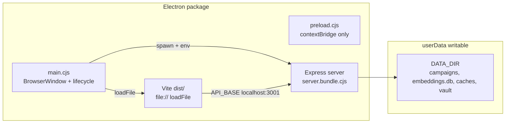

# Electron Desktop Packaging Guide

- **Audience:** Developers and AI agents implementing or maintaining a macOS / Windows / Linux desktop build of Narrative Engine.
- **Goal:** Map the real client/server architecture for packaging, inventory Electron hooks already in the repo, and give a concrete `electron-builder` recipe — grounded in this codebase, not generic Electron tutorials.
- **Sister docs:**
  - [monetization-and-deployment.md](./monetization-and-deployment.md) — Model A (one-time download), Stage 1 roadmap, LOTM IP vs engine-only SKU
  - [demo-vps-player-deployment.md](./demo-vps-player-deployment.md) — Hosted demo path; future Downloads section
  - [lotm-landing-page.md](./lotm-landing-page.md) — Do not promise desktop downloads until CI ships artifacts
  - [docker-build-performance.md](./docker-build-performance.md) — Native rebuild timing (`better-sqlite3`, `sqlite-vec`, `onnxruntime-node`) — same pain as Electron ABI
  - [COOLIFY.md](../COOLIFY.md) — Current production ship path (Docker), not Electron
  - [AI_CODEBASE_MAP.md](../../AI_CODEBASE_MAP.md) — Module boundaries (treat Electron claims as **stale** until this pipeline lands)

---

## 1. System Map

Narrative Engine is a **local-first** TTRPG manager: a React/Vite frontend talks to an Express API on `127.0.0.1:3001`. Campaign JSON, vector embeddings, vault keys, and model caches live on disk under `DATA_DIR`.



### Runtime modes

| Mode | How it runs today | Frontend ↔ API |
|---|---|---|
| **Dev** | [`scripts/start-dev.mjs`](../../scripts/start-dev.mjs): Vite `:5173` + `node server.js` `:3001` | Relative `/api` via Vite proxy |
| **Web prod** | Docker / Coolify: Express serves `dist/` same-origin when `NODE_ENV=production` ([`server.js`](../../server.js)) | Relative `/api` |
| **Electron prod** | **Not implemented** — main must start Express, then `loadFile(dist/index.html)` | Absolute `http://localhost:3001/api` via [`apiBase.ts`](../../src/lib/apiBase.ts) |

### Layers agents must keep in mind

| Layer | Stack | Packaging note |
|---|---|---|
| Frontend | React 19 + Vite 8 + Zustand + Tailwind 4 | Build to `dist/`; `base: './'` already set |
| Backend | Express 5 ESM ([`server.js`](../../server.js) + `server/`) | Bundle to CJS for Electron; externalize `.node` natives |
| Storage | `data/campaigns/*.json`, `data/embeddings.db` | Must be **writable** under `app.getPath('userData')` |
| Natives | `better-sqlite3`, `sqlite-vec`, `onnxruntime-node`, `sharp` | Rebuild for Electron ABI; unpack from ASAR |
| Models | HF embedder + Kokoro TTS | First-run downloads; caches must not live inside ASAR |

---

## 2. Current State vs Stale Docs

| Claim | Repo truth |
|---|---|
| `electron/main.cjs` and `build-server.mjs` listed in [`ARCHITECTURE.md`](../../ARCHITECTURE.md) / [`AI_CODEBASE_MAP.md`](../../AI_CODEBASE_MAP.md) | **Absent** from the tree |
| Electron / electron-builder in [`package.json`](../../package.json) | **Not declared**; no pack scripts |
| [`.gitignore`](../../.gitignore) lines 76–78 | Intentionally ignores `electron/` and `build-server.mjs` (“not maintained in repo”) |
| Working ship paths | Local Node (`npm run dev`, `start.sh` / `.bat`) and Docker/Coolify |

**Trap for agents:** Do not assume Electron already works because system maps mention it. Those entries describe intended/legacy design. Until `electron/` is committed and CI publishes artifacts, landing copy must stay “Coming soon” ([lotm-landing-page.md](./lotm-landing-page.md)).

When implementing the pipeline, **remove** `electron/` and `build-server.mjs` from `.gitignore` so the packaging code is versioned.

---

## 3. Existing Electron Hooks (Reuse, Do Not Reinvent)

| File | Behavior |
|---|---|
| [`src/lib/apiBase.ts`](../../src/lib/apiBase.ts) | If `window.location.protocol === 'file:'`, `API_BASE` / `ASSET_BASE` point at `http://localhost:3001` |
| [`vite.config.ts`](../../vite.config.ts) | `base: './'` so hashed assets resolve under `file://` |
| [`server.js`](../../server.js) | CORS allowlist includes origin `'null'` (Electron `file://`); binds `HOST` default `127.0.0.1`, port `3001` |
| [`server/vault.js`](../../server/vault.js) | If `process.versions.electron`, uses `electron.safeStorage` for OS-encrypted remembered vault key |
| [`server/services/archiveService.js`](../../server/services/archiveService.js) | If Electron, uses `electron.shell` to open archive files; else `child_process` fallback |
| [`server/lib/tts/cache.js`](../../server/lib/tts/cache.js) | `applyHfCacheEnv()` sets `HF_HOME` / `TRANSFORMERS_CACHE` / etc. **before** importing `kokoro-js` so nested transformers do not write inside read-only ASAR |
| [`server/lib/fileStore.js`](../../server/lib/fileStore.js) | Env overrides: `DATA_DIR`, `MODS_DIR`, `BUNDLED_MODS_DIR`, `LOTM_ASSETS_DIR` |

### Protocol contract (Electron prod)

1. Main starts Express on `127.0.0.1:3001` with writable `DATA_DIR`.
2. Main calls `BrowserWindow.loadFile(.../dist/index.html)` → renderer origin is `"null"`.
3. Renderer uses absolute API URLs ([`apiBase.ts`](../../src/lib/apiBase.ts)).
4. CORS accepts `'null'` ([`server.js`](../../server.js)).

Do not switch the renderer to `loadURL('http://localhost:3001')` unless you deliberately drop the `file:` branch — that path is already wired for `loadFile`.

### Env overrides main must set before spawning the server

```text
DATA_DIR          = <userData>/data
MODS_DIR          = <userData>/mods          # optional; writable user mods
BUNDLED_MODS_DIR  = <resources>/bundled-mods # read-only inside package
LOTM_ASSETS_DIR   = <resources>/gamedata     # if shipping LOTM art
NODE_ENV          = production
PORT              = 3001
HOST              = 127.0.0.1
```

Also ensure HF/TTS cache env is applied early (server already calls `applyHfCacheEnv()` for Kokoro; embedder cache should land under `DATA_DIR/.embeddings_cache`).

---

## 4. How to Add Electron (Implementation Recipe)

Committed defaults — do not fork these without updating this doc:

| Decision | Choice |
|---|---|
| Tooling | **electron-builder** |
| Main / preload | `electron/main.cjs` + `electron/preload.cjs` |
| Security | `nodeIntegration: false`, `contextIsolation: true`, preload `contextBridge` only |
| Server in package | esbuild Express → `server.bundle.cjs` via `build-server.mjs`; main **spawns** it as a child with the env above |
| UI load | `loadFile` on Vite `dist/index.html` |
| ASAR | Pack JS; **`asarUnpack`** native module trees |
| Targets | Windows `nsis`; macOS `dmg` (+ optional zip); Linux `AppImage` + `deb` |
| CI | lotm-site GitHub Actions: clone LOTM-GAME, pack on `windows-latest` / `macos-latest` (arm64) / `macos-15-intel` (x64) / `ubuntu-22.04`, attach to LOTM-SITE Releases |
| Marketing | lotm-site download buttons open LOTM-SITE GitHub Releases |

### 4.1 Files to create

| Path | Role |
|---|---|
| `electron/main.cjs` | App lifecycle, single-instance lock, spawn server, create window, quit/cleanup |
| `electron/preload.cjs` | Minimal `contextBridge` API if needed (prefer none initially) |
| `build-server.mjs` | esbuild entry: bundle `server.js` + `server/**` → `server.bundle.cjs`; **external** native addons |
| `electron-builder.yml` or `package.json` `build` key | `appId`, files, `asarUnpack`, per-OS targets |
| `.github/workflows/electron.yml` | **Moved to lotm-site** — clones LOTM-GAME, packs, uploads Release assets on LOTM-SITE |

### 4.2 `package.json` scripts (sketch)

```json
{
  "main": "electron/main.cjs",
  "scripts": {
    "build": "tsc -b && vite build",
    "build:server": "node build-server.mjs",
    "electron:dev": "npm run build && npm run build:server && electron .",
    "electron:pack": "npm run build && npm run build:server && electron-builder --publish never",
    "electron:dir": "npm run build && npm run build:server && electron-builder --dir"
  },
  "devDependencies": {
    "electron": "<pin>",
    "electron-builder": "<pin>",
    "@electron/rebuild": "<pin>"
  }
}
```

Pin Electron and rebuild natives against that ABI after install:

```bash
npx electron-rebuild -f -w better-sqlite3,sqlite-vec,onnxruntime-node,sharp
```

### 4.3 Main process lifecycle (required behavior)

1. `app.requestSingleInstanceLock()` — second instance focuses the first (port `3001` is exclusive).
2. Resolve paths: `userData`, packaged `resources` / `app.getAppPath()`.
3. Set env (`DATA_DIR`, mods, assets, `NODE_ENV`, HF caches).
4. Spawn `server.bundle.cjs` (or `node` on the bundle) as child; wait until `http://127.0.0.1:3001/health` (or equivalent) responds.
5. Create `BrowserWindow` with secure webPreferences; `loadFile` → `dist/index.html`.
6. On quit: kill child server, flush logs.

### 4.4 Server bundle (`build-server.mjs`)

- Entry: project-root [`server.js`](../../server.js) (ESM today).
- Output: CommonJS `server.bundle.cjs` suitable for packaged Node/Electron.
- **Mark as external** (do not bundle): `better-sqlite3`, `sqlite-vec`, `onnxruntime-node`, `sharp`, and any other `.node` producers.
- Keep `esbuild` (already a dep) as the bundler.

### 4.5 electron-builder config sketch

```yaml
appId: com.narrativeengine.app
productName: Narrative Engine
directories:
  output: release
files:
  - dist/**
  - electron/**
  - server.bundle.cjs
  - package.json
  - node_modules/better-sqlite3/**
  - node_modules/sqlite-vec/**
  - node_modules/onnxruntime-node/**
  - node_modules/sharp/**
  # plus runtime JS deps the bundle still requires
asar: true
asarUnpack:
  - "**/*.node"
  - "**/better-sqlite3/**"
  - "**/sqlite-vec/**"
  - "**/onnxruntime-node/**"
  - "**/sharp/**"
extraResources:
  - from: public/bundled-mods
    to: bundled-mods
  # optional LOTM SKU:
  # - from: gamedata
  #   to: gamedata
win:
  target: [nsis]
mac:
  target: [dmg, zip]
  category: public.app-category.games
linux:
  target: [AppImage, deb]
  category: Game
```

Adjust `files` / `extraResources` after a dry `--dir` build so missing modules fail in CI, not on users' machines.

### 4.6 Build pipeline order

1. `npm ci`
2. Rebuild natives for **Electron** ABI (not system Node)
3. `npm run build` → Vite `dist/`
4. `npm run build:server` → `server.bundle.cjs`
5. `electron-builder` per OS
6. Code-sign (macOS notarize + Windows Authenticode) using CI secrets — never commit certs
7. Upload artifacts to **lotm-site** GitHub Releases (`TheMagiche/LOTM-SITE`)
8. lotm-site download CTAs open that release page

### 4.7 CI matrix (sketch)

| Runner | Artifact |
|---|---|
| `windows-latest` | `.exe` / NSIS installer (x64) |
| `macos-latest` | Apple Silicon `.dmg` (`--mac --arm64`) |
| `macos-15-intel` | Intel `.dmg` (`--mac --x64`); required for 2013–2020 64-bit Macs |
| `ubuntu-22.04` | `.AppImage` + `.deb` (x64) |

Reuse lessons from Docker: [`Dockerfile`](../../Dockerfile) already runs `npm rebuild better-sqlite3 sqlite-vec sharp onnxruntime-node` — Electron CI must do the same against Electron's Node ABI. See [docker-build-performance.md](./docker-build-performance.md).

---

## 5. Native Modules & ASAR Checklist

| Package | Role | Packaging rule |
|---|---|---|
| `better-sqlite3` | `data/embeddings.db` | Rebuild for Electron; unpack `.node` |
| `sqlite-vec` | Vector extension | Same |
| `onnxruntime-node` | Local embedder | Same; large binary; platform matrix |
| `sharp` | Image pipelines (Docker rebuilds it) | Same |
| `@huggingface/transformers` / Kokoro | Models + cache | Writable cache under `DATA_DIR`; call `applyHfCacheEnv()` before import |

**Must not:**

- Leave native `.node` files only inside packed ASAR (load fails or crashes).
- Let HF / Kokoro default caches write under `app.asar` / read-only `node_modules` (re-download every launch — already documented in [`server/lib/tts/cache.js`](../../server/lib/tts/cache.js)).
- Point `DATA_DIR` at the project root inside the install directory (often read-only or wiped on update).

**Writable layout under userData (recommended):**

```text
<userData>/
  data/
    campaigns/
    embeddings.db
    .embeddings_cache/
    .tts_cache/
    apikeys.vault
    settings.json
    backups/
    portraits/
  mods/                 # user-installed
```

Bundled mods and LOTM `gamedata` stay in `extraResources` (read-only), referenced via `BUNDLED_MODS_DIR` / `LOTM_ASSETS_DIR`.

---

## 6. Per-OS Notes

### macOS

- Targets: `dmg` (+ `zip` for direct download).
- Architectures: ship `arm64` and `x64` (or universal) — natives must match.
- Notarization + hardened runtime required for Gatekeeper on public downloads.
- `safeStorage` in [`vault.js`](../../server/vault.js) uses Keychain when Electron is detected.

### Windows

- Target: `nsis` installer.
- Users may need Visual C++ redistributable for native addons if not statically linked — document in release notes (README already mentions VC++ Build Tools for local Node rebuilds).
- Authenticode signing avoids SmartScreen blocks.
- Paths: prefer `app.getPath('userData')` (under `%APPDATA%`); avoid writing next to `Program Files`.

### Linux

- Targets: `AppImage` (portable) + `deb`.
- Sandbox / FUSE: AppImage needs FUSE on some distros — note in release notes.
- Test on at least one Debian/Ubuntu LTS and one Fedora/Arch-class host if claiming broad support.

### Port & single instance

[`apiBase.ts`](../../src/lib/apiBase.ts) hardcodes `localhost:3001`. Main process must:

- Hold a single-instance lock.
- Fail clearly if `3001` is occupied by a non-app process (or optionally honor `PORT` in both main and `apiBase` — that would be a coordinated code change).

---

## 7. Packaging Blockers & Product Constraints

| Blocker | Mitigation |
|---|---|
| Native ABI matrix | `@electron/rebuild` in CI per OS/arch |
| ASAR + model caches | `DATA_DIR` + `applyHfCacheEnv()` |
| Hardcoded API port | Single-instance lock; document port conflict |
| First-run model download size | Progress UI / offline docs; caches persist in userData |
| LOTM IP (`gamedata/`, mechanics) | Engine-only SKU vs fan-content edition — see [monetization-and-deployment.md](./monetization-and-deployment.md) |
| Stale architecture maps | Update maps after pipeline lands; until then this doc is authoritative for Electron |

---

## 8. Implementation Pointer Table (for Agents)

| Feature needed | Likely touch points |
|---|---|
| Electron main / preload | New `electron/main.cjs`, `electron/preload.cjs` |
| Server bundle | New `build-server.mjs`; stop gitignoring it |
| Pack scripts / builder | [`package.json`](../../package.json) `main`, `scripts`, `build` key or `electron-builder.yml` |
| Un-ignore packaging code | [`.gitignore`](../../.gitignore) — remove `electron/` and `build-server.mjs` entries |
| API under `file://` | Already [`src/lib/apiBase.ts`](../../src/lib/apiBase.ts) |
| CORS for Electron | Already [`server.js`](../../server.js) (`'null'`) |
| Writable data paths | Main sets env → [`server/lib/fileStore.js`](../../server/lib/fileStore.js) |
| Vault OS encryption | Already [`server/vault.js`](../../server/vault.js) |
| Open archive in OS | Already [`server/services/archiveService.js`](../../server/services/archiveService.js) |
| TTS / HF ASAR workaround | Already [`server/lib/tts/cache.js`](../../server/lib/tts/cache.js) |
| CI artifacts | lotm-site `.github/workflows/electron.yml` → Releases on `TheMagiche/LOTM-SITE` |
| Local upload + cleanup | `npm run electron:release` ([`scripts/electron-release-lotm-site.mjs`](../../scripts/electron-release-lotm-site.mjs)) uploads `release/` installers and deletes local copies already on that tag |
| Landing Downloads | lotm-site polls **this site repo’s** GitHub Releases; CTAs open that release page |
| Monetization Stage 1 | [monetization-and-deployment.md](./monetization-and-deployment.md) Model A |

---

## 9. What NOT to Do

- Do not load the UI before Express is listening on `3001` (renderer will fail API calls).
- Do not pack native `.node` binaries only inside ASAR without `asarUnpack`.
- Do not write embeddings / HF / TTS caches under the ASAR or install directory.
- Do not leave `DATA_DIR` defaulting to the packaged project root.
- Do not enable `nodeIntegration: true` or disable `contextIsolation`.
- Do not promise Windows / macOS / Linux downloads on the landing page until CI publishes signed (or at least built) artifacts.
- Do not commit code-signing certificates, Apple notarization creds, or API keys.
- Do not treat [`AI_CODEBASE_MAP.md`](../../AI_CODEBASE_MAP.md) / [`ARCHITECTURE.md`](../../ARCHITECTURE.md) Electron file listings as present until this pipeline is implemented.
- Do not ship a commercial LOTM-branded build without IP review ([monetization-and-deployment.md](./monetization-and-deployment.md)).

---

## 10. Out of Scope for This Guide

- Implementing `electron/`, adding npm deps, or adding GitHub Actions workflows (documentation only)
- Steam / itch.io / Gumroad store listing copy
- Mobile companion packaging ([NarrativeEngine-M](https://github.com/Sagesheep/NarrativeEngine-M))
- Rewriting [`AI_CODEBASE_MAP.md`](../../AI_CODEBASE_MAP.md) / [`ARCHITECTURE.md`](../../ARCHITECTURE.md) (optional follow-up once the pipeline exists)
- Changing the hosted Docker/Coolify deploy path
