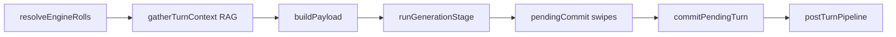

# LOTM gameplay runtime

- **Audience:** an agent about to change mechanics, prompts, seeding, or turn stages. Not a player manual.
- **Goal:** how a Lord of the Mysteries chronicle actually runs on this host.
- **Sister doc:** [ui-lore-improvements.md](./ui-lore-improvements.md) — player-facing UI gaps. Read that only if you are changing chrome.
- **Do not touch:** the loot tree walker, dice fairness pool, NPC agency, or the NPC / faction / location / item ledgers. Seed them; do not replace them.
- **Do not rewrite** `runTurn` as a combat simulator. This is a narrative GM OS with a LOTM world pack.

If a path below does not answer your question, the code is the source of truth — update this file.

---

## Product shape

This app is a **generic narrative GM OS** (dice fairness, loot tree walker, ledgers, lore RAG, swipe/commit) with a **Lord of the Mysteries world pack and illustrated skin**.

`LOTM_EXCLUSIVE_UI` in [`src/services/lotm/lotmFlags.ts`](../../src/services/lotm/lotmFlags.ts) is `true`. Empty `rulesRaw` therefore injects [`mechanics/Ruleset/AI_GM_OS_LOTM_v1.md`](../../mechanics/Ruleset/AI_GM_OS_LOTM_v1.md) via [`src/services/rules/defaultRules.ts`](../../src/services/rules/defaultRules.ts) — never the generic TTRPG fallback.

A LOTM campaign is `worldPackId === 'lord-of-the-mysteries'` or `uiSkin === 'lotm-illustrated'` ([`src/services/lotm/lotmSkin.ts`](../../src/services/lotm/lotmSkin.ts) `isLotmCampaign`). Church/geography hydrator merges run **only** for those campaigns.

---

## Session loop

1. **Title hub / tarot PC pick** — [`LotmTitleHub.tsx`](../../src/components/lotm/LotmTitleHub.tsx), [`LotmTarotSelect.tsx`](../../src/components/lotm/LotmTarotSelect.tsx).
2. **Create** — [`createLotmCampaign.ts`](../../src/services/lotm/createLotmCampaign.ts) writes the campaign (`uiSkin: 'lotm-illustrated'`), then [`campaignInit.ts`](../../src/services/campaignInit.ts) with `attachLotmVisuals: true`. Pack files live in [`src/worldpacks/lordOfTheMysteries.ts`](../../src/worldpacks/lordOfTheMysteries.ts).
3. **Index overlay**, then **illustrated play** — [`LotmIllustratedShell.tsx`](../../src/components/lotm/LotmIllustratedShell.tsx): HUD + dialogue plate + composer.
4. **Player types**; optional armed dice / loot. [`runTurn`](../../src/services/turn/turnOrchestrator.ts) is the composition root; stages live in [`turnStages.ts`](../../src/services/turn/turnStages.ts).
5. **Engine injects tags.** The GM narrates them and must not invent conflicting numbers.
6. **Swipe, then commit.** First variant is `pendingCommit`. Commit on next send or campaign switch ([`pendingCommit.ts`](../../src/services/turn/pendingCommit.ts) → [`postTurnPipeline.ts`](../../src/services/turn/postTurnPipeline.ts)). Ledgers update after commit.

### Turn timing

| Phase | What happens |
|-------|----------------|
| Pre-send | Surprise / encounter / world-event DCs; fairness pool or armed dice/loot. One-shot and absolute-command injects are not durable history. |
| Generate | Stream GM reply. Tool loop (lore query, `roll_dice`, notebook, `propose_inventory_change`) capped. |
| Finish | First variant stamped `pendingCommit`; snapshot + cached payload frozen for swipes. |
| Commit | Archive scene; post-commit tracks (profile / inventory / location scans, PC drift, relationship memory). |

Armed inputs (`armedRoll`, `armedLoot`, `armedOneShot`, `absoluteCommand`) are cleared before `runTurn`.

---

## Engine-owned vs prompt-owned

The GM **narrates** engine tags. It does not recompute them.

| Domain | Owner | Where |
|--------|--------|--------|
| 3-band d20 fairness pool | Engine | [`packages/engine/src/rolls/engineRolls.ts`](../../packages/engine/src/rolls/engineRolls.ts) via [`src/services/engine/engineRolls.ts`](../../src/services/engine/engineRolls.ts). LOTM init sets `diceSystem` unset so this legacy pool runs. |
| Sequence-as-Advantage | Engine | [`lotmBeyonderState.ts`](../../src/worldpacks/lotmBeyonderState.ts) `resolveSequenceAdvantage` + `applySequenceAdvantageToDiceOutcomes` in `resolveEngineRolls`. Collapses the pool to one band so the GM cannot cherry-pick. Lower Sequence number is stronger. No on-stage Beyonder → Advantage (even Seq 9 vs mundanes). Stronger opponent Sequence → Disadvantage. Same Sequence → Normal. Spirituality 0 or LoC ≥ 2 → Disadvantage. |
| Armed dice result | Engine | Real roll at send; auto pool suppressed. |
| Spirituality spend | Engine | Armed dice: −1 via `applySpiritualityDelta` on `characterProfile.mp`. At 0 SPI, LoC may bump. |
| Loss of Control 0–3 | Engine | `pcMeta.lossOfControl`. Stage 3 injects `[WORLD_EVENT: … Nighthawks …]`. Labels: stable / tells / slippage / rampage. |
| Digestion **display** + stall instruction | Engine injects `%` in `[BEYONDER]` | `pcMeta.digestion` (0–100). Seeded 0. |
| Digestion **increases** and Sequence promotion | Prompt | Rules tell the GM not to promote below 100%. There is no engine tick that raises digestion or drinks a potion. |
| Surprise / encounter / world-event tags | Engine | `rollEngines` |
| Armed loot identity | Engine | Loot walker + [`lootToInventory.ts`](../../src/services/engine/lootToInventory.ts). `[LOOT DROP]` is fact. `BOUNTY:` is a hunt contract, not the PC wanted line. |
| Purse totals `CR:` | Engine | Inventory currency rows ([`lotmPurse.ts`](../../src/worldpacks/lotmPurse.ts)). Default seed: 10 soli. |
| `[CURRENCY]` conversions | Engine | [`lotmCurrency.ts`](../../src/worldpacks/lotmCurrency.ts) from gamedata JSON. 1 pound = 20 soli = 240 pence. |
| NPC Standing `pcRelation` −3..+3 | Engine | [`affinityAccess.ts`](../../src/services/npc/affinityAccess.ts). Prompt gets band **words**, never raw numbers. NPC updater **strips** LLM `pcRelation` / affinity patches. |
| On-stage `PLAY AS:` | Engine | [`src/services/payload/world.ts`](../../src/services/payload/world.ts) |
| Pathway / Sequence on kits | Engine | [`lotmPathways.ts`](../../src/worldpacks/lotmPathways.ts) `attachLotmPathwaysToNpcs` |
| `[BEYONDER]` block | Engine | Acting Method, next formula, SPI, digestion, LoC — narrate only. |
| Ability catalog slice | Engine | [`lotmAbilityCompendium.ts`](../../src/worldpacks/lotmAbilityCompendium.ts) `formatLotmAbilityBlock` |
| Prose, dialogue, which actions need `roll_dice` | Prompt | Subject to MC Boundary + realism test in LOTM rules MD. |
| Masquerade, ritual flavor, Spirit Vision as range, church hush | Prompt / RAG | Rules MD + lore chunks. |
| Inventory except armed loot | Prompt proposes | Player confirms `propose_inventory_change`. |

**Hybrid after commit:** profile / inventory / location scans **suggest**; the engine clamps forbidden keys and dedupes ledgers.

Character and location **lore chunks are RAG-disabled on import**. Ledgers are authoritative ([`campaignInit.ts`](../../src/services/campaignInit.ts)).

---

## What a new chronicle seeds

When `attachLotmVisuals` is true:

- Lore markdown chunked into SQLite RAG (character/place chunks not retrieved as lore — they become ledgers).
- LOTM rules markdown as `rulesRaw`.
- [`mechanics/World_compendium/Lord of the Mysteries/loot.json`](../../mechanics/World_compendium/Lord%20of%20the%20Mysteries/loot.json) — root keys `ordinary` / `mystical` / `characteristics` / `currency` / `medicine` / `artifact` / `bounty` / `formula`. Player labels: [`lotmLootLabels.ts`](../../src/worldpacks/lotmLootLabels.ts).
- Tingen as `currentPlaceId`.
- Canon NPCs with Neutral Standing (`pcRelation: 0`; lore Affinity 50).
- Orthodox churches JSON → faction ledger ([`lotmChurches.ts`](../../src/worldpacks/lotmChurches.ts)).
- Geography JSON → location ledger ([`lotmGeography.ts`](../../src/worldpacks/lotmGeography.ts)).
- Item catalog from `gamedata/assets/data/items/` lists ([`lotmItemCatalog.ts`](../../src/worldpacks/lotmItemCatalog.ts)).
- Chosen PC `signatureKit` (pathway + sequence + abilities), purse, `pcMeta.digestion = 0`, `lossOfControl = 0`.
- First composer prompt from the PC background ([`lotmOpeningPrompt.ts`](../../src/services/lotm/lotmOpeningPrompt.ts)); interview starter is replaced so the GM begins the scene.
- `diceSystem = undefined` (3-band fairness pool).
- Ability-compendium warmup (lazy 2.4MB JSON).

Reload path: [`campaignHydrator.ts`](../../src/store/campaignHydrator.ts). Church/geo merge is gated by `isLotmCampaign`, not by exclusive-UI alone.

---

## Payload layering

[`payloadBuilder.ts`](../../src/services/payload/payloadBuilder.ts):

- **Stable (cached):** LOTM rules chunks tagged `rag: always`.
- **Volatile:** ledgers, retrieved lore, location, inventory `CR:`, `[CURRENCY]`, `[BEYONDER ABILITIES]` when the PC has a pathway.
- **User tail:** player input plus engine prefixes from `resolveEngineRolls` (`[DICE OUTCOMES]`, `[SEQUENCE AS TIER]`, `[BEYONDER]`, events, loot).

The GM must not invent a purse total, a dice band, or a Standing number that contradicts those injections.

---

## Player-visible vs GM-only

| Fact | Player UI today | GM prompt |
|------|-----------------|-----------|
| Pathway, Sequence ladder, Spirit | HUD always | Profile minify `Seq` / `SPI` |
| Digestion %, bounty | HUD **expanded inventory**; bounty hidden when none/zero | `[BEYONDER]`, `BOUNTY:` |
| Purse | HUD **Carried** coin rows | `CR:` |
| Loss of Control | Hidden | `[BEYONDER]` |
| Sequence band (Adv/Normal/Disadv) | Hidden | `[SEQUENCE AS TIER]` + collapsed pool |
| Acting Method, next formula | Stats “To advance”; not HUD | `[BEYONDER]` |
| Ability names | HUD ability line | `[BEYONDER ABILITIES]` |
| Lore RAG hits | Indexing overlay only | Retrieved chunks in world block |
| Standing | Record tab, non-zero `pcRelation` | Band words on `PLAY AS:` |

Surfacing the hidden column is UI work. Do not move Sequence math or Standing into the LLM to “make it visible.”

---

## Path index

| Module | Role |
|--------|------|
| [`lotmFlags.ts`](../../src/services/lotm/lotmFlags.ts) | Exclusive-UI gate |
| [`lotmSkin.ts`](../../src/services/lotm/lotmSkin.ts) | `isLotmCampaign` |
| [`createLotmCampaign.ts`](../../src/services/lotm/createLotmCampaign.ts) | New chronicle |
| [`lotmOpeningPrompt.ts`](../../src/services/lotm/lotmOpeningPrompt.ts) | First composer prompt + skip-interview starter |
| [`campaignInit.ts`](../../src/services/campaignInit.ts) | Bootstrap ledgers, loot, Tingen, dice |
| [`campaignHydrator.ts`](../../src/store/campaignHydrator.ts) | Reload; LOTM merge gated |
| [`turnOrchestrator.ts`](../../src/services/turn/turnOrchestrator.ts) | `runTurn` |
| [`turnStages.ts`](../../src/services/turn/turnStages.ts) | `resolveEngineRolls` LOTM branch |
| [`pendingCommit.ts`](../../src/services/turn/pendingCommit.ts) | Swipe / commit |
| [`world.ts`](../../src/services/payload/world.ts) | NPC / faction / item / currency / abilities injection |
| [`lotmBeyonderState.ts`](../../src/worldpacks/lotmBeyonderState.ts) | Sequence, SPI, digestion, LoC, `[BEYONDER]` |
| [`lotmPathways.ts`](../../src/worldpacks/lotmPathways.ts) | Abilities + `*_advancement.json` (acting method, formula, backlash) |
| [`lotmChurches.ts`](../../src/worldpacks/lotmChurches.ts) | Faction merge |
| [`lotmGeography.ts`](../../src/worldpacks/lotmGeography.ts) | Location merge |
| [`lotmCurrency.ts`](../../src/worldpacks/lotmCurrency.ts) | `[CURRENCY]` |
| [`lotmAbilityCompendium.ts`](../../src/worldpacks/lotmAbilityCompendium.ts) | Catalog slice |
| [`lotmPurse.ts`](../../src/worldpacks/lotmPurse.ts) | Purse / bounty lines |
| [`AI_GM_OS_LOTM_v1.md`](../../mechanics/Ruleset/AI_GM_OS_LOTM_v1.md) | Prompt-owned rules |

What the GM cannot do: override the collapsed dice band, invent `CR:`, write `pcRelation`, or pick Advantage when the engine chose Disadvantage.
