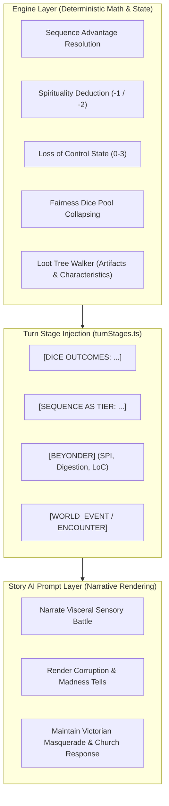

# LOTM Combat Runtime & Action Resolution

- **Audience:** Backend/engine and turn-orchestration agents implementing or modifying Beyonder combat, spirituality, Loss of Control, and action resolution.
- **Goal:** Replace generic D&D 5e / TTRPG combat tropes (HP bars, AC, spell slots, d20 attrition math) with authentic Lord of the Mysteries in-world combat mechanics while respecting the narrative GM OS boundaries.
- **Sister docs:**
  - [gameplay-runtime.md](./gameplay-runtime.md) — chronicle host runtime and turn loop.
  - [lotm-loot-and-artifacts.md](./lotm-loot-and-artifacts.md) — characteristics, Sealed Artifacts, and economy.
  - [lotm-ui-combat-restructuring.md](./lotm-ui-combat-restructuring.md) — player-facing combat HUD and modal restructuring.

---

## 1. D&D Combat vs. Lord of the Mysteries Combat Paradigm

| Dimension | Generic D&D / TTRPG Mode | Lord of the Mysteries In-World Mode |
|---|---|---|
| **Core Metric** | Hit Points (HP) & Armor Class (AC) | Spirituality (SPI), Sequence Tier, & Loss of Control (LoC) |
| **Damage & Pacing** | Attrition-based: chipping HP down over multiple rounds | Decisive & Lethal: a single unmitigated Beyonder ability or physical headshot can kill immediately |
| **Power Differential** | Linear scaling (Level 1 to 20; bounded accuracy) | Exponential Sequence Dominance: Lower Sequence numbers hold absolute advantage; high Sequences (Demigods Seq 4+) operate beyond human comprehension |
| **Action Economy** | Move / Action / Bonus Action / Reaction | Mental Invocations, Physical Maneuvers, Ritual Preparations, and Sealed Artifact brandishing |
| **Spell / Ability Cost** | Vancian Spell Slots or Spell Points (FOC) | Spirituality drain (-1 to -3 SPI); at 0 SPI, character is physically drained and risks immediate madness |
| **Failure Consequences** | Missing an attack or taking HP damage | Backlash, potion corruption, mental breakdown, or escalating Loss of Control (Tells -> Slippage -> Rampage) |
| **Information Warfare** | Perception vs. Stealth checks | Spirit Vision, Divination, Danger Intuition, Astromancy, and Mystical Concealment |
| **Supernatural Law** | Magic is commonplace and visible | Supernatural Secrecy / Masquerade: ordinary mortals rationalize oddities; orthodox churches deploy kill teams |

---

## 2. Core Beyonder Combat Mechanics

### 2.1 Sequence as Absolute Tier (`resolveSequenceAdvantage`)

In the Lord of the Mysteries universe, Sequence hierarchy is absolute:
1. **Against Mundane Opponents:** Even a Sequence 9 Beyonder holds overwhelming **Advantage** against non-Beyonders.
2. **Same Sequence Contests:** Resolved at **Normal** tier unless one combatant exploits a known pathway counter, environmental affinity, or prepared ritual item.
3. **Against Higher Sequence Opponents (lower number):** The lower-sequence character suffers **Disadvantage** and fatal danger unless exploiting sealed artifacts, heavy preparation, or group ambush.
4. **Engine Collapsing Rule:** The runtime calculates the Sequence band before the prompt is generated (`lotmBeyonderState.ts`) and collapses the 3-band fairness pool to the single engine-selected band (`[SEQUENCE AS TIER: Advantage/Normal/Disadvantage]`). The GM model cannot cherry-pick or override this tier.

### 2.2 Spirituality Resource Loop (`characterProfile.mp`)

Spirituality is the lifeblood and limiter of all Beyonder powers:
- **Starting Pool:** Seeded on character creation (typically 10 max for Sequence 9, scaling with Sequence advancement).
- **Expenditure:**
  - Standard Beyonder Ability: -1 SPI.
  - High-tier ability / Overextension / Ritual magic: -2 to -3 SPI.
  - Passive perception (e.g. baseline Spirit Vision flickers): 0 SPI.
- **Zero Spirituality State:**
  - When SPI drops to 0, the Beyonder becomes "ordinary flesh with secrets."
  - Rolls are forced to **Disadvantage**.
  - Any further ability use immediately triggers a **Loss of Control check** (`bumpLossOfControl`).
- **Recovery:**
  - Natural rest, sleep, cogitation/meditation, or consuming calming herbal teas (soothing potions).

### 2.3 Loss of Control (LoC) Escalation (Stages 0 to 3)

Madness and corruption are constant threats in the mystical world:

- **Stage 0 (Stable):** Normal mental equilibrium. No adverse narrative tells.
- **Stage 1 (Tells):** Auditory hallucinations, distorted color vision, abnormal cravings, strange murmurs.
- **Stage 2 (Slippage):** Partial physiological mutations, uncontrolled ability misfires, loss of emotional control. Forces Disadvantage on all rolls.
- **Stage 3 (Rampage):** Complete mental drowning into Mythical Creature Form. Irreversible loss of character agency. Engine injects:
  `[WORLD_EVENT: Church of the Evernight Nighthawks deploy a containment team after a Loss of Control rampage in Tingen]`

### 2.4 Pre-Combat & Tactical Phases

LotM combat is won before the first strike is thrown:
1. **Divination & Astromancy:**
   - Dowsing rod, pendulum, dream divination, tarot readings.
   - Reveals danger levels, enemy trajectories, and weaknesses, but attracts attention of high-sequence beings if directed at them.
2. **Spirit Vision & Aura Reading:**
   - Detects emotional state (aura colors), health/ethereal body, and presence of specters/wraiths.
3. **Ritual Magic & Containment:**
   - Creating a Wall of Spirituality (using a silver dagger) to seal sound, smell, and mystical vibrations from alerting the police or church.
   - Sacrificial offerings to Orthodox Deities or Tarot Club "The Fool".
4. **Pathway Counters & Interactions:**
   - Spectator/Visionary: Psychological cues, placating madness, mental dragon breath.
   - Sleepless/Darkness: Slumber inducement, nightmare domain, soul assurance.
   - Seer/Fool: Paper figurine substitutes, illusion manipulation, flame jumping, air bullets.
   - Mystery Pryer/Hermit: Spell scrolls, elemental analysis, magic circles.

---

## 3. Engine-Owned vs. Prompt-Owned Architecture

### Engine Responsibilities:
- Comparing Sequence numbers between PC and on-stage NPCs.
- Decrementing Spirituality on armed rolls.
- Escalating Loss of Control when limits are exceeded.
- Suppressing cherry-picking by collapsing dice fairness pools into single bands.
- Enforcing potion digestion gates (advancement strictly blocked until 100% digestion).

### Prompt Responsibilities:
- Describing the physical and supernatural manifestation of abilities (fog, crimson flames, dark velvet darkness, psychic waves).
- Adhering to the Realism Test and Perception Protocol (NPCs cannot sense off-stage events or unseen mystical actions).
- Maintaining the Victorian / Loen social masquerade (bystanders fleeing from "gas explosions", police cordons).
- Never overturning engine-injected outcomes or inventing contradictory resource values.

---

## 4. Opponent Threat Tiers (Replacing D&D CR & Mooks)

In place of generic D&D challenge ratings (CR 1/4 to CR 20), opponents are classified by their in-world Beyonder standing:

1. **Mundane Threats (Street thugs, police constables, wild animals):**
   - Sequence: None (Mundane).
   - Combat Rule: Automated PC Advantage. Any active Beyonder ability neutralizes them instantly unless the PC is caught completely off-guard.
2. **Low-Sequence Beyonders (Sequence 9 to 8):**
   - Sequence: 9 (e.g., Seer, Sleepless, Hunter, Assassin) or 8 (e.g., Clown, Midnight Poet).
   - Combat Rule: Enhanced human capabilities with 1-2 distinct mystical edges. Lethal physical weapons remain highly effective.
3. **Mid-Sequence Beyonders (Sequence 7 to 5):**
   - Sequence: 7 (e.g., Magician, Pyromancer, Nightmare), 6, or 5 (e.g., Marionettist, Wraith, Desire Apostle).
   - Combat Rule: Qualitative transformation. Possess powerful offensive/defensive domains (flame jump, shadow assimilation, puppet control). Requires tactical counter-measures.
4. **High-Sequence Demigods (Sequence 4 to 1) & Angels:**
   - Sequence: 4 (Saint/Mythical Creature partial) to 0 (True Deity).
   - Combat Rule: Overwhelming divine authority. Mundane senses fail; gazing directly at their true form causes immediate insanity or spontaneous combustion. Direct confrontation without equivalent grade artifacts is suicidal.
5. **Corrupted / Rampaging Aberrations:**
   - Mutated Beyonders at Loss of Control Stage 3. Unpredictable, immense physical/spiritual virulence, immune to mental persuasion.

---

## 5. Implementation Roadmap for Agents

When implementing changes to the combat system:
1. **Extend `src/worldpacks/lotmBeyonderState.ts`**:
   - Support fine-grained spirituality costs per ability type (minor trick vs. major ritual).
   - Implement temporary sanity/spirituality recovery actions (e.g. `sootheSpirituality`).
2. **Update Turn Stages (`src/services/turn/turnStages.ts`)**:
   - Ensure `resolveEngineRolls` injects pathway-specific combat context without leaking D&D stat names (`PWR`, `VIT`, `AC`).
3. **Align Tool Registry (`src/services/turn/toolHandlers.ts`)**:
   - Update `roll_dice` tool prompts to refer to Beyonder difficulty and spirituality spend.
   - Refuse any tool calls that attempt to calculate HP damage.
