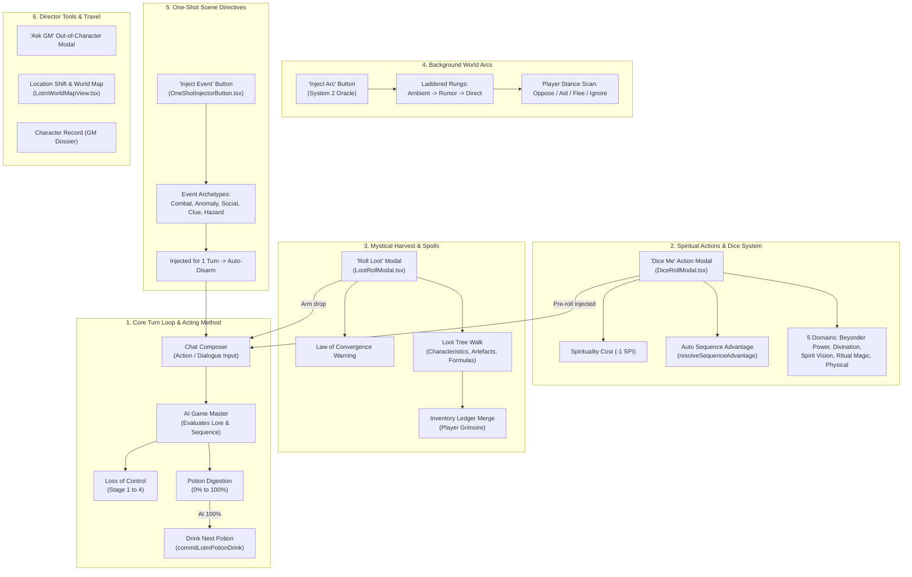

# Lord of the Mysteries Gameplay & Mechanics Guide: How to Play System

- **Audience:** Frontend UI engineers, backend engine developers, content designers, and AI agents implementing gameplay mechanics, onboarding flows, or rulebooks in Narrative Engine / LOTM Desktop.
- **Goal:** Provide authoritative documentation on the 6 core mechanics governing Lord of the Mysteries gameplay (Acting Method & Turn Loop, Spiritual Actions & Dice System, Mystical Harvest & Loot Drops, Background World Arcs, One-Shot Scene Directives, Director Tools & Travel), and explain how the interactive `LotmHowToPlayGuide.tsx` component surfaces them to players.
- **Sister docs:**
  - [lotm-player-and-lore-grimoires.md](./lotm-player-and-lore-grimoires.md) — Grimoire modal architecture and navigation rails.
  - [lotm-ui-combat-restructuring.md](./lotm-ui-combat-restructuring.md) — Player HUD, meters, and modal restructuring.
  - [lotm-loot-and-artifacts.md](./lotm-loot-and-artifacts.md) — Loot tables, Sealed Artefacts, and economy.
  - [lotm-combat-runtime.md](./lotm-combat-runtime.md) — In-world combat resolution and advantage calculations.

---

## 1. System Map & User Interface Placement



---

## 2. The Six Core Gameplay Dimensions

### 2.1 Core Turn Loop & The Acting Method
- **Roleplay Alignment:** As in the novel, consuming an extraordinary potion traps the remnant spiritual consciousness and madness of prior owners within the Beyonder's astral body. The only way to digest the potion is to "Act"—strictly adhering to the title, behavior, and occult principles of your Sequence (e.g., a *Seer* divines fate and remains humble before the unknown; a *Clown* uses humor and smiles to mask genuine pain).
- **Digestion Meter ($0\% \to 100\%$):** Stored in `playerCharacter.pcMeta.digestion`. The AI Game Master increases digestion when the player makes decisions that fulfill the acting principles.
- **Loss of Control (LOC):** Stored in `playerCharacter.pcMeta.lossOfControl`. Rises when the player violates acting principles, consumes incorrect ingredients, overdraws spirituality, or encounters unshielded Great Old Ones / Mythical Creature forms.
  - *Stage 1 (Subtle Murmurs):* Auditory hallucinations and slight headache.
  - *Stage 2 (Spiritual Slippage):* Disadvantage on all rolls, illusory visions.
  - *Stage 3 (Imminent Collapse):* Physical deformities, body mutation, severe sanity loss.
  - *Stage 4 (Irreversible Rampager):* Complete monster transformation and character death.
- **Sequence Advancement:** Once digestion hits $100\%$, the player opens the Player Grimoire (`Potion & Pathway` tab), satisfies advancement rituals, and clicks "Drink Next Sequence Potion".

---

### 2.2 Spiritual Actions & Dice System (`Dice Me`)
- **Invocation Point:** Clicked via `Dice Me` in the chat action strip or by tapping the pathway emblem in `LotmPlayerHud.tsx`.
- **The Five Action Domains:**
  1. **Beyonder Power:** Channeling sequence abilities (e.g. *Spirit Vision*, *Paper Figurine Substitute*, *Flame Controlling*, *Divination*).
  2. **Divination:** Dowsing rods, pendulum, dream revelations, astromancy, and coin tosses.
  3. **Spirit Vision:** Inspecting the emotional, health, and spiritual colors of auras.
  4. **Ritual Magic:** Formulating deity honorific names, altar boundaries, and sacrificial offerings.
  5. **Physical / Mundane:** Standard Victorian combat (revolvers, cane strikes, street brawling, stealth, running).
- **Automatic Sequence Advantage:** Computed via `resolveSequenceAdvantage()` comparing the player's Sequence tier against on-stage NPC opponents in `npcLedger`:
  - Higher Sequence tier $\to$ **Advantage** (rolls $2\text{d}20$, keeps highest).
  - Equivalent Sequence tier $\to$ **Normal** (rolls $1\text{d}20$).
  - Lower Sequence tier or 0 Spirituality $\to$ **Disadvantage** (rolls $2\text{d}20$, keeps lowest).
- **Spirituality Costs:** Deducts $-1\text{ SPI}$ upon confirmation. Casting at $0\text{ SPI}$ triggers critical fatigue warnings and accelerates LOC.
- **Outcome Bands:**
  - `1–2`: Catastrophe / Critical Backlash.
  - `3–9`: Failure / Complication.
  - `10–14`: Mixed / Partial Success.
  - `15–19`: Full Success.
  - `20`: Critical Triumph.

---

### 2.3 Mystical Harvest & Loot Drops (`Roll Loot`)
- **Invocation Point:** Clicked via `Roll Loot` in the chat action strip when looting defeated monsters, harvesting ingredients, or raiding hidden tombs.
- **Deterministic Loot Trees:** The engine walks `context.lootTree` using seed-based RNG, guaranteeing reproducible, LLM-independent drops.
- **Categories:**
  - *Extraordinary Characteristics:* Indestructible mystical remnants of slain Beyonders.
  - *Sealed Artefacts:* Items with powerful active boons and dangerous negative flaws (Grades 3 to 0).
  - *Potion Formulas:* Recipes listing main and supplementary ingredients.
  - *Charms & Talismans:* Consumable silver or copper amulets.
  - *Loen Currency:* Gold Pounds (£), Soli (s), and Pence (d).
- **Law of Beyonder Characteristics Convergence:** High-grade loot stored in the inventory subtly attracts like-pathway entities, enemy cultists, and Church Nighthawks.
- **Automatic Inventory Merging:** All items drop directly into `inventoryItems` in the store and surface inside the Player Grimoire.

---

### 2.4 Background World Arcs (`Inject Arc`)
- **Invocation Point:** Clicked via `Inject Arc` on the action strip.
- **System 2 Oracle:** Spawns an autonomous, laddered storyline anchored to open chapter threads (`computeOpenThreads`), NPC relationship pressures, and recent GM narration.
- **Escalation Rungs:**
  1. *Ambient:* Subtle world clues, newspaper reports, economic shifts.
  2. *Rumor:* Gossip in taverns, NPC anxieties, indirect faction movements.
  3. *Direct:* Active confrontation, street riots, assassination attempts, or cataclysms.
- **Stance Scanning (`scanArcStance`):** The engine monitors player messages for keywords to detect player posture (*Oppose*, *Aid*, *Flee*, *Ignore*), shifting the DC and narrative progression of the arc.

---

### 2.5 One-Shot Scene Directives (`Inject Event`)
- **Invocation Point:** Clicked via `Inject Event` on the action strip.
- **Immediate Scene Twists:** Injects an unyielding prompt directive for the immediate next turn, forcing the AI GM to generate an unexpected crisis or lead:
  - *Ambush & Combat:* Hostile Beyonder or monster attack.
  - *Mystical Anomaly:* Spirit world breach, unusual astrological omen, or corruption.
  - *Social / Political Crisis:* Police raid, noble scandal, or unexpected visitor.
  - *Sudden Clue:* A hidden diary, dropped tarot card, or secret symbol.
  - *Environmental Hazard:* Smog explosion, collapsed tunnel, or sudden storm.
- **Lifecycle:** Arms the store with `armedOneShot`. On the next sent message, the directive is attached to the prompt, executed by the GM, and cleared immediately.

---

### 2.6 Director Tools, World Map & Travel
- **Ask GM (OOC):** Out-of-character consultation window that answers lore, sequence, and rule questions without advancing narrative game time.
- **Location Shifting & Fast Travel:** The player selects any discovered location or canonical city in the Player Grimoire (`Location & Travel` tab) and clicks "Shift Location" to fast-travel.
- **Interactive Cartography (`LotmWorldMapView.tsx`):** Explores the Northern Continent (Loen, Intis, Feysac, Fenepot), the Southern Continent, and the Five Seas.

---

## 3. Component Architecture: `LotmHowToPlayGuide.tsx`

The `LotmHowToPlayGuide` component is a self-contained, interactive handbook mounted inside both the World Lore Grimoire (`LotmGrimoire.tsx`) and the Player Grimoire (`LotmPlayerGrimoire.tsx`).

### 3.1 Features & State Management
- **Category Switching:** `all`, `loop`, `dice`, `loot`, `arcs`, `events`, and `tools`.
- **Search Query Filter:** Real-time filtering across titles, subtitles, summaries, and step descriptions.
- **Accordion Step-by-Step Breakdown:** Clicking a topic card expands its step-by-step instructions, practical advice, and lore axioms.
- **Thematic Callouts:**
  - *Mysticism Axiom (Amber):* Occult novel lore rules.
  - *Tactical Advice (Blue):* Strategic tips for surviving encounters.
  - *Danger / Backlash Hazard (Red):* Warnings against madness, LOC, and artefact corruption.
- **UI Location Badge:** Shows players exactly where each action button is located on the screen.

### 3.2 Navigation Rail Layout & Styling

In `src/index.css`:
```css
.lotm-grimoire-rail {
  display: flex;
  flex-direction: column;
  width: 154px;
  flex-shrink: 0;
  padding: 12px 10px;
  border-right: 1px solid rgba(201, 162, 39, 0.18);
}

.lotm-grimoire-rail-top {
  display: flex;
  flex-direction: column;
  gap: 4px;
  flex: 1 1 auto;
}

.lotm-grimoire-rail-bottom {
  display: flex;
  flex-direction: column;
  gap: 4px;
  margin-top: auto;
  padding-top: 10px;
  border-top: 1px solid rgba(201, 162, 39, 0.18);
}
```

---

## 4. Verification & Testing

The guide is covered by automated unit tests in:
- `src/components/lotm/__tests__/LotmGrimoire.test.tsx`
- `src/components/lotm/__tests__/LotmPlayerGrimoire.test.tsx`

Tests verify:
1. Pinned button rendering at the bottom of the navigation rail.
2. Clicking "How to Play" transitions state to `section === 'guide'`.
3. Category filter switching correctly displays matching guide sections.
4. Expanding cards renders full step procedures and tactical callouts.
