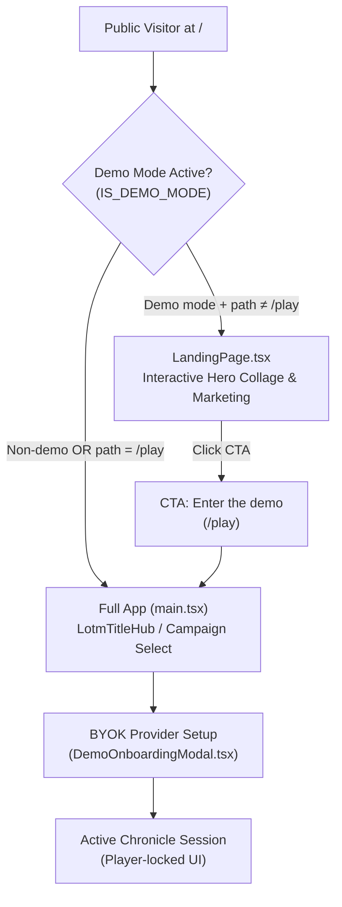

# Lord of the Mysteries Landing Page & Marketing Guide

- **Audience:** Developers, UI engineers, operators, and AI agents maintaining the demo landing page, marketing copy, or public onboarding flows.
- **Goal:** Document the content hierarchy, styling conventions, dark neumorphic design tokens, interactive hero collage, and source data mapping for the public Lord of the Mysteries landing page ([`LandingPage.tsx`](../../src/components/landing/LandingPage.tsx)).
- **Sister docs:**
  - [demo-vps-player-deployment.md](./demo-vps-player-deployment.md) — Public VPS demo deployment, session lifecycle, and BYOK gate.
  - [lotm-how-to-play-guide.md](./lotm-how-to-play-guide.md) — Authoritative rules for the 6 core LOTM gameplay systems.
  - [monetization-and-deployment.md](./monetization-and-deployment.md) — Packaging strategy, Electron roadmap, and LOTM IP boundaries.
- **Do not touch / Do not change:**
  - **Do not promise Electron downloads** until the `electron-builder` CI pipeline is active; keep desktop platform items flagged as coming soon.
  - **Do not remove the fan-content disclaimer** from the footer.
  - **Do not store visitor API keys** on the server during demo sessions.

---

## 1. System Map & Entry Routing

---

## 2. Marketing Sections & Source Data Mapping

All landing page text is centralized in [`src/components/landing/landingCopy.ts`](../../src/components/landing/landingCopy.ts) to ensure consistency across UI and documentation.

| Section | Headline / Concept | Source in Codebase | Purpose & Key Takeaways |
|---------|--------------------|--------------------|-------------------------|
| **Hero & Interactive Collage** | *Lord of the Mysteries* — A Victorian occult chronicle. Interactive character & pathway constellation. | [`LotmTitleHub.tsx`](../../src/components/lotm/LotmTitleHub.tsx), [`lotmPathways.ts`](../../src/worldpacks/lotmPathways.ts), [`landingCopy.ts`](../../src/components/landing/landingCopy.ts) | Replaced static cover with a parallax collage of Tarot characters and pathway emblems with interactive inspection tabs. |
| **Core Pillars** | Occult Mechanics & Rules of Beyonder Reality | [`lotm-how-to-play-guide.md`](./lotm-how-to-play-guide.md), [`README.md`](../../README.md) | 5 feature cards: Acting Method, Spiritual Actions, Mystical Harvest, Memory That Never Forgets, Living World & NPCs. |
| **How It Plays** | Turn Lifecycle (01 → 02 → 03) | [`gameplay-runtime.md`](./gameplay-runtime.md), [`LotmHowToPlayGuide.tsx`](../../src/components/lotm/LotmHowToPlayGuide.tsx) | Demystifies the core loop: 1. Write actions, 2. Witness reply & swipe variants, 3. Advance Pathway & digest potions. |
| **BYOK Callout** | Bring Your Own Key | [`demo-vps-player-deployment.md`](./demo-vps-player-deployment.md) §1 | Explains browser-local key security (OpenRouter/OpenAI/Ollama) and ephemeral session cleanup. |
| **Self-Host** | Self-host the chronicle | [`README.md`](../../README.md) §Getting Started | Directs power users to the open-source GitHub repository and desktop setup instructions. |
| **Sponsor the Project** | Sponsor on Ko-fi | [`landingCopy.ts`](../../src/components/landing/landingCopy.ts) | Direct link to Ko-fi (`https://ko-fi.com/themagiche`) to support server hosting and development. |
| **Special Thanks & Sources** | Attribution & Lore Sources | [`landingCopy.ts`](../../src/components/landing/landingCopy.ts) | Attributions to Narrative-P Engine (`github.com/Sagesheep/NarrativeEngine-P`), LOTM Wiki (`lordofthemysteries.fandom.com/wiki/`), and author Cuttlefish That Loves Diving. |
| **Desktop Builds** | Desktop builds (Windows, macOS, Linux) | [`monetization-and-deployment.md`](./monetization-and-deployment.md) §8 | Muted placeholder cards with a "Coming soon" badge (no premature download links). |
| **Footer** | Creator Website, Ko-fi, MIT License, IP Disclaimer | [`landingCopy.ts`](../../src/components/landing/landingCopy.ts) | Links to Creator (`themagiche.vercel.app`), Sponsor, MIT license, and fan-content disclaimer. |

---

## 3. Visual Styling & Dark Neumorphism Tokens

The landing page extends the `lotm-illustrated` skin with dark neumorphic surfaces and interactive occult layers:

- **Base Ground:** `#0b0a0d` (near-black occult background).
- **Interactive Hero Collage (`.lotm-collage-floating-card`):**
  - Mesh of floating cards with individual coordinates, subtle tilt angles, and mouse parallax tracking (`translate3d`).
  - Hover / active elevation: scales to `1.18x`, illuminates with gold runic aura (`box-shadow: 0 0 22px rgba(201, 162, 39, 0.42)`), and reveals Tarot Arcanum and Beyonder identity.
- **Hero Showcase Bar (`.lotm-hero-showcase-bar`):**
  - Frosted glass + neumorphic panel (`rgba(14, 12, 17, 0.88)` with `backdrop-filter: blur(14px)`).
  - Tab switcher between *Tarot Club & Beyonders* and *22 Divine Pathways*.
  - Inspection plate showcasing pathway sequence ranges and character quotes.
- **Extruded Cards (`.lotm-landing-card`):**
  - Surface: `#121015`
  - Shadow: `8px 8px 18px #050408, -6px -6px 14px #1c1822`
  - Border: `1px solid rgba(201, 162, 39, 0.12)` (subtle gold hairline)
  - Hover: Lift `-2px` with expanded gold border `rgba(201, 162, 39, 0.32)`
- **Inset Wells (`.lotm-landing-well-card`):**
  - Surface: `#0e0c11`
  - Inset Shadow: `inset 4px 4px 10px #060507, inset -3px -3px 8px #191620`
  - Used for BYOK callout, Self-Host info, Sponsor card, and Desktop Builds plate.
- **Typography:**
  - Headers & Kickers: `'Cinzel', serif` in `#f3ead8` / `#c9a227`.
  - Body & Descriptions: `'EB Garamond', Georgia, serif` in `rgba(243, 234, 216, 0.76)`.

---

## 4. Brand Vocabulary Reference

When updating marketing or onboarding text, use authentic Lord of the Mysteries terminology:

| Prefer This Term | Avoid / Replace | Context |
|------------------|-----------------|---------|
| **Chronicle** | Save file / session | Player save instances |
| **Beyonder** | Mage / wizard / hero | Characters with supernatural powers |
| **Pathway & Sequence** | Class & level | The 22 advancement ladders (Sequence 9 to 0) |
| **Spirituality (SPI)** | Mana / MP | Supernatural resource powering abilities |
| **Potion Digestion** | XP / level grinding | Acting according to the Sequence name |
| **Loss of Control (LOC)** | Sanity loss / curse | Madness stages from violations or trauma |
| **Sealed Artefact** | Magic item / relic | Dangerous items with negative side-effects |
| **Extraordinary Characteristics** | Loot drop / soul gem | Indestructible remnants of deceased Beyonders |
| **Law of Convergence** | Spawn rate | High-grade characteristics attracting similar entities |
| **Grimoire** | Wiki / compendium | In-game knowledge books (World Lore vs Player) |

---

## 5. Key File Index

| Component / File | Path | Description |
|------------------|------|-------------|
| **Landing View** | [`src/components/landing/LandingPage.tsx`](../../src/components/landing/LandingPage.tsx) | Main marketing and demo entry component with interactive hero collage. |
| **Marketing Copy** | [`src/components/landing/landingCopy.ts`](../../src/components/landing/landingCopy.ts) | Content constants, pillar definitions, links, collage data, special thanks, and disclaimers. |
| **Unit Tests** | [`src/components/landing/__tests__/LandingPage.test.tsx`](../../src/components/landing/__tests__/LandingPage.test.tsx) | Tests validating headings, pillars, CTA links, tabs, sponsor, credits, and footer links. |
| **Styling** | [`src/index.css`](../../src/index.css) | `.lotm-landing*` and `.lotm-collage*` CSS classes and dark neumorphic definitions. |
| **Routing Gate** | [`src/main.tsx`](../../src/main.tsx) | Determines whether to render `LandingPage` or `App`. |
| **Demo Config** | [`src/config/demoMode.ts`](../../src/config/demoMode.ts) | Path helpers (`DEMO_PLAY_PATH = '/play'`) and deployment flags. |
