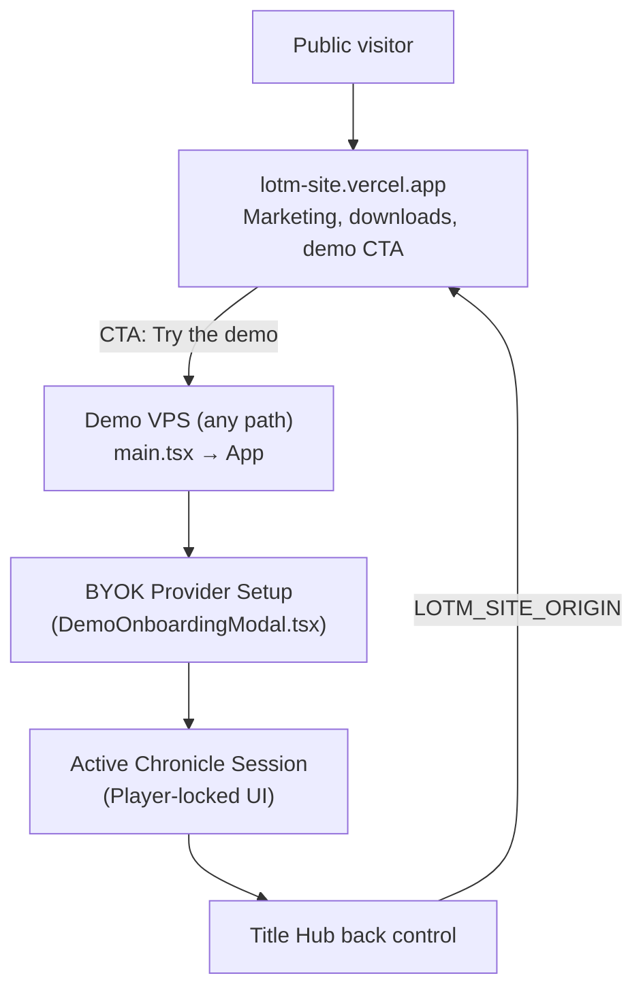

# Lord of the Mysteries Landing Page & Marketing Guide

- **Audience:** Developers, UI engineers, operators, and AI agents maintaining public onboarding, demo entry, or marketing copy.
- **Goal:** Document the split between the hosted marketing site ([lotm-site](https://lotm-site.vercel.app)) and this repo’s Player-only demo. Public visitors land on lotm-site; the VPS demo boots play immediately.
- **Sister docs:**
  - [demo-vps-player-deployment.md](./demo-vps-player-deployment.md) — Public VPS demo deployment, session lifecycle, and BYOK gate.
  - [lotm-how-to-play-guide.md](./lotm-how-to-play-guide.md) — Authoritative rules for the 6 core LOTM gameplay systems.
  - [monetization-and-deployment.md](./monetization-and-deployment.md) — Packaging strategy, Electron roadmap, and LOTM IP boundaries.
  - [electron-desktop-packaging.md](./electron-desktop-packaging.md) — Desktop packaging recipe; keep Downloads “coming soon” until CI artifacts exist.
- **Do not touch / Do not change:**
  - **Do not reintroduce `LandingPage.tsx`** (or any `/` vs `/play` marketing gate) in this demo app. Marketing lives in lotm-site.
  - **Do not promise Electron downloads** until the `electron-builder` CI pipeline is active; keep desktop platform items flagged as coming soon on lotm-site.
  - **Do not remove the fan-content disclaimer** from the lotm-site footer.
  - **Do not store visitor API keys** on the server during demo sessions.

---

## 1. System Map & Entry Routing

Public marketing and the playable demo are separate deploys. This app always mounts `App` — there is no in-bundle landing route.

| Surface | Host | What the visitor sees |
|---------|------|------------------------|
| **Marketing** | [lotm-site.vercel.app](https://lotm-site.vercel.app) | Hero, gameplay pillars, BYOK/self-host copy, downloads, sponsor, footer. |
| **Demo play** | VPS (`lotmdnd.work.gd` and any path including `/` or `/play`) | Title Hub + BYOK + Player UI. `main.tsx` always renders `App`. |
| **Back** | Title Hub arrow in demo mode | `href` = [`LOTM_SITE_ORIGIN`](../../src/config/demoMode.ts) (`https://lotm-site.vercel.app`). |

---

## 2. Marketing Ownership (lotm-site)

Hero, pillars, how-it-plays, BYOK callout, self-host, sponsor, special thanks, desktop downloads, and the fan-content footer live in **lotm-site**, not this repository.

When editing that site, keep copy aligned with:

| Section | Source of truth in this repo (for wording, not UI) |
|---------|-----------------------------------------------------|
| **How it plays / pillars** | [lotm-how-to-play-guide.md](./lotm-how-to-play-guide.md), [`LotmHowToPlayGuide.tsx`](../../src/components/lotm/LotmHowToPlayGuide.tsx) |
| **BYOK + ephemeral sessions** | [demo-vps-player-deployment.md](./demo-vps-player-deployment.md) §1 and §4 |
| **Self-host** | [`README.md`](../../README.md) Getting Started |
| **Desktop builds** | [monetization-and-deployment.md](./monetization-and-deployment.md) §8 — muted “Coming soon” until CI artifacts exist |
| **Demo CTA target** | Public demo origin (VPS). Do not send visitors through a second marketing page inside this app. |

---

## 3. Demo Title Hub Chrome (this repo)

The Title Hub keeps a parallax Tarot collage as play chrome. That is **not** the public landing page.

- **Collage data:** [`landingCopy.ts`](../../src/components/landing/landingCopy.ts) (`LANDING_COLLAGE_CARDS`)
- **Render:** [`LotmTitleHub.tsx`](../../src/components/lotm/LotmTitleHub.tsx)
- **Boot splash:** [`index.html`](../../index.html) `#lotm-boot-splash`, dismissed from [`main.tsx`](../../src/main.tsx) via [`preloadLandingAssets.ts`](../../src/components/landing/preloadLandingAssets.ts)

Dark neumorphic tokens used by the hub collage:

- **Base Ground:** `#0b0a0d`
- **Floating cards (`.lotm-collage-floating-card`):** mesh with mouse parallax; hover scale `1.18x` and gold aura `box-shadow: 0 0 22px rgba(201, 162, 39, 0.42)`
- **Typography:** `'Cinzel', serif` for kickers; `'EB Garamond', Georgia, serif` for body

---

## 4. Brand Vocabulary Reference

When updating marketing (lotm-site) or onboarding text, use authentic Lord of the Mysteries terminology:

| Prefer This Term | Avoid / Replace | Context |
|------------------|-----------------|---------|
| **Chronicle** | Save file / session | Player save instances |
| **Beyonder** | Mage / wizard / hero | Characters with supernatural powers |
| **Pathway & Sequence** | Class & level | The 22 advancement ladders (Sequence 9 to 0) |
| **Spirituality (SPI)** | Mana / MP | Supernatural resource powering abilities |
| **Potion Digestion** | XP / level grinding | Acting according to the Sequence name |
| **Loss of Control (LOC)** | Sanity loss / curse | Madness stages from violations or trauma |
| **Sealed Artefact** | Magic item / relic | Dangerous items with negative side-effects |
| **Extraordinary Characteristics** | Loot drop / soul gem | Indestructible remnants of deceased Beyonders |
| **Law of Convergence** | Spawn rate | High-grade characteristics attracting similar entities |
| **Grimoire** | Wiki / compendium | In-game knowledge books (World Lore vs Player) |

---

## 5. Key File Index

| Component / File | Path | Description |
|------------------|------|-------------|
| **Marketing site** | [lotm-site.vercel.app](https://lotm-site.vercel.app) | Public landing, downloads, and demo CTA. |
| **App boot** | [`src/main.tsx`](../../src/main.tsx) | Always mounts `App`; dismisses the boot splash. |
| **Demo origin** | [`src/config/demoMode.ts`](../../src/config/demoMode.ts) | `LOTM_SITE_ORIGIN` for the Title Hub back link. |
| **Title Hub** | [`src/components/lotm/LotmTitleHub.tsx`](../../src/components/lotm/LotmTitleHub.tsx) | Demo back control + collage chrome. |
| **Collage data** | [`src/components/landing/landingCopy.ts`](../../src/components/landing/landingCopy.ts) | Tarot portrait mesh for Title Hub only. |
| **Boot splash** | [`src/components/landing/preloadLandingAssets.ts`](../../src/components/landing/preloadLandingAssets.ts) | Dismisses `#lotm-boot-splash`. |
| **Styling** | [`src/index.css`](../../src/index.css) | `.lotm-landing*` / `.lotm-collage*` classes still used by Title Hub. |
