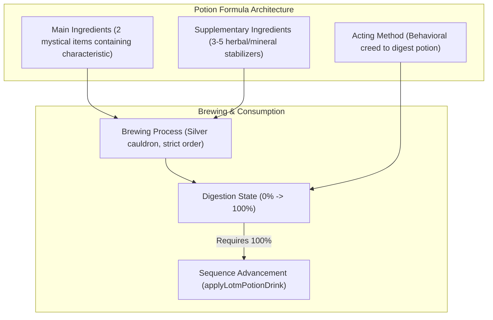
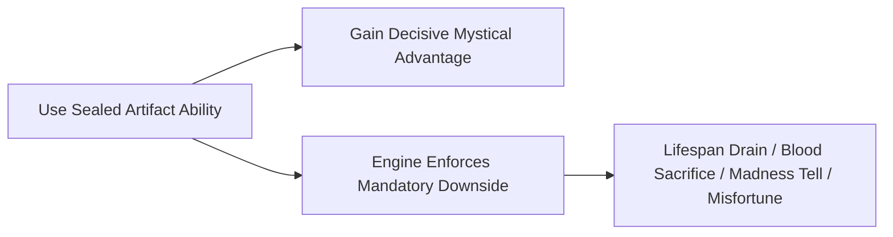

# LOTM Loot, Sealed Artifacts & Economy

- **Audience:** Backend/engine, item ledger, and loot integration agents implementing or expanding drops, mystical items, Sealed Artifacts, and Victorian economic systems.
- **Goal:** Replace generic D&D loot tables (gold coins, generic +1 swords, common-to-legendary gear) with authentic Lord of the Mysteries mystical items, Beyonder characteristics, potion formulas, Sealed Artifact flaws, and Loen currency.
- **Sister docs:**
  - [gameplay-runtime.md](./gameplay-runtime.md) — chronicle host runtime.
  - [lotm-combat-system.md](./lotm-combat-system.md) — in-world combat and action resolution.
  - [lotm-ui-combat-restructuring.md](./lotm-ui-combat-restructuring.md) — player-facing UI and modal restructuring.

---

## 1. D&D Loot vs. Lord of the Mysteries Mystical Spoils

| Loot Dimension | Generic D&D / TTRPG Mode | Lord of the Mysteries Mode |
|---|---|---|
| **Currency** | Gold, Silver, Copper pieces (decimal 10:1) | Loen Monies: Gold Pounds, Soli, Pence (1 Pound = 20 Soli = 240 Pence) |
| **Defeated Foes** | Random gold coins, generic armor, scrap | Beyonder Characteristics (indestructible mystical cores) or ordinary Victorian personal effects |
| **Magic Items** | Unconditional stat boosts (+1 weapon, Ring of Protection) | Sealed Artifacts & Beyonder Weapons: massive distinct powers accompanied by inevitable, dangerous **Flaws / Downsides** |
| **Advancement Items** | Experience points, spellbooks | Potion Formulas (Main + Supplementary ingredients) & Extraordinary Materials |
| **Item Rarity** | Common / Uncommon / Rare / Very Rare / Legendary | Grade 3 (Dangerous) / Grade 2 (Very Dangerous) / Grade 1 (Extremely Dangerous) / Grade 0 (Catastrophic) |
| **Economic Scale** | Inflationary (thousands of gold coins carried in pouches) | Grounded Victorian Purchasing Power (1-2 pounds/week is a solid living wage; potions cost hundreds of pounds) |

---

## 2. The Law of Beyonder Characteristics

### 2.1 Indestructibility & Precipitation
- Beyonder characteristics never disappear, degrade, or get destroyed.
- Upon the death of a Beyonder or extraordinary creature, their characteristic precipitates out over several minutes:
  - If uncontaminated, it forms a solid gem-like characteristic of their pathway and sequence.
  - If a nearby object absorbs it during death, it mutates into a **Beyonder Weapon** or **Sealed Artifact**.

### 2.2 Law of Convergence
- Characteristics belonging to the same pathway or neighboring pathways exert an innate mystical attraction towards one another.
- Carrying high-grade characteristics or artifacts increases the probability of encounter events involving same-pathway Beyonders, secret order cultists, or church containment teams.

---

## 3. Potion Formulas & Extraordinary Ingredients

Advancement in Lord of the Mysteries requires exact chemical and mystical brewing:

### 3.1 Main Ingredients
- Bear the core spiritual essence of the Sequence (e.g. *Pit Viper Heart*, *Shadow Tree Bark*, *Farsight Bird Eyes*).
- Can be substituted by a precipitated Beyonder Characteristic of the exact sequence.

### 3.2 Supplementary Ingredients
- Ordinary or low-grade spiritual materials (e.g. *distilled water*, *lavender extract*, *chamomile powder*, *pure spirit oil*).
- Lessen the pain and spiritual turbulence of consumption; missing supplementary ingredients drastically increases the chance of immediate Loss of Control upon drinking.

---

## 4. Sealed Artifacts (Grades & Deterministic Flaws)

All Sealed Artifacts in the world follow the fundamental iron law: **Power and payment arrive together.**

### 4.1 Grade Classifications (`gamedata/assets/data/items/`)

1. **Grade 3 (Dangerous / Containable):**
   - *Threat Level:* Minor local danger; easily contained in wood, lead, or silver-lined boxes.
   - *Examples:*
     - `3-1328 Eye of Crystal`: Allows direct vision of spiritual bodies and ghosts. *Downside:* Attracts wraiths and causes irreversible vision deterioration with prolonged use.
     - `3-0782 Mutated Sun Sacred Emblem`: Purifies entities in a 15-meter radius. *Downside:* Transforms the user into a fervent, mindless sun worshipper if held too long.
2. **Grade 2 (Very Dangerous / Strict Containment):**
   - *Threat Level:* Capable of destroying a street or building; requires continuous containment rituals or human guardians.
   - *Examples:*
     - `2-105 Blood Vessel Thief`: Steals enemy Beyonder abilities for 10 minutes. *Downside:* Permanently burns away weeks or months of the user's lifespan.
     - `2-247 Pride Armor`: Grants Dawn Paladin strength and armor. *Downside:* Indiscriminately executes weak humans nearby and causes inevitable betrayal.
3. **Grade 1 (Extremely Dangerous / District Hazard):**
   - *Threat Level:* Capable of laying waste to a city district; kept in church cathedral subterranean vaults under permanent seal.
4. **Grade 0 (Catastrophic / Continental Threat):**
   - *Threat Level:* Capable of destroying a nation or rewriting reality. Sealed by high-sequence Angels and True Deities (e.g. *0-08 Quill of Alzuhod*).

---

## 5. Victorian Loen Monetary Economy

The currency system is strictly anchored to Fifth Epoch Victorian standards (`src/worldpacks/lotmCurrency.ts` and `lotmPurse.ts`).

### 5.1 Currency Conversions
$$\text{1 Gold Pound (\pounds)} = \text{20 Soli (s)} = \text{240 Pence (d)}$$
$$\text{1 Soli} = \text{12 Pence}$$

### 5.2 Purchasing Power Benchmarks
- **1–2 Pence:** A loaf of rye bread, newspaper, public carriage ride in Tingen.
- **5–10 Soli:** A decent dinner at a mid-tier restaurant, bottle of wine, formal shirt.
- **1–2 Gold Pounds:** Weekly wage of an ordinary factory worker or junior clerk.
- **3–5 Gold Pounds:** Weekly salary of a police constable, detective, or university lecturer.
- **300–500 Gold Pounds:** Price of a Sequence 9 Potion Formula + Ingredients at a mystical underground market.
- **1,000–3,000 Gold Pounds:** Price of a Grade 3 Sealed Artifact or Sequence 7 characteristic.

---

## 6. Loot Tree Structure (`loot.json`)

The deterministic loot walker (`packages/engine/src/loot/lootEngine.ts`) navigates `mechanics/World_compendium/Lord of the Mysteries/loot.json` using the following root keys:

| Engine Key | Player-Facing Label (`lotmLootLabels.ts`) | Contents |
|---|---|---|
| `currency` | Currency (pence / soli / pounds) | Loen coin rows and banknotes added directly to purse |
| `ordinary` | Ordinary goods | Victorian attire, pocket watches, silver daggers, revolver ammo |
| `medicine` | Medicine & Tonics | Calming herbal tea, wound salve, sedative potions |
| `mystical` | Mystical items & Beyonder weapons | Purified silver weapons, enchanted revolvers, charms |
| `characteristics` | Ingredients & characteristics | Extraordinary beast materials, solidified Beyonder gems |
| `artifact` | Sealed Artifacts | Grade 3 and Grade 2 artifacts with explicit downsides |
| `bounty` | Hunt contracts | Official police or church bounty notices on fugitive Beyonders |
| `formula` | Potion formulas | Parchments containing exact Sequence potion recipes |

---

## 7. Inventory Integration (`src/services/engine/lootToInventory.ts`)

When loot is armed and rolled (`armLoot` in `LootRollModal.tsx`):
1. The engine walks `loot.json` and produces concrete `LootItem` instances.
2. `mergeLootIntoInventory` categorizes each item into `carried`, `equipped`, or `currency`.
3. Currency items (Pence, Soli, Pounds) are aggregated and formatted by `formatLotmPurseLine` (e.g. `10 soli, 6 pence`).
4. Artifacts retain their `flaw` and `code` fields in the item ledger, allowing UI components and the GM prompt to enforce containment costs.
