# LOTM Grimoire Separation: Player Grimoire, World Lore Grimoire & How to Play Guide

- **Audience:** Frontend UI and engineering agents working on the Lord of the Mysteries (LOTM) theme, player HUD, navigation menus, world reference systems, and gameplay guides in Narrative Engine / LOTM Desktop.
- **Goal:** Document the architectural separation of grimoires into two dedicated components—the **Lord of the Mysteries (World Lore) Grimoire** (home screen encyclopedia) and the **Player Grimoire** (in-game protagonist dossier)—along with the unified **How to Play Guide** pinned to the bottom of their navigation rails.
- **Sister docs:**
  - [lotm-how-to-play-guide.md](./lotm-how-to-play-guide.md) — Comprehensive guide to the 6 core gameplay systems (Dice, Loot, Arcs, Events, Turn Loop, GM Tools).
  - [lotm-ui-combat-restructuring.md](./lotm-ui-combat-restructuring.md) — LOTM UI, combat meters, and player HUD architecture.
  - [lotm-loot-and-artifacts.md](./lotm-loot-and-artifacts.md) — Loot, characteristics, purse currency, and Sealed Artefacts.
  - [gameplay-runtime.md](./gameplay-runtime.md) — Chronicle host runtime.
  - [ui-view-modes.md](./ui-view-modes.md) — UI view modes and permission boundaries.

---

## 1. Overview & Architectural Data Flow

Prior to this separation, a single monolithic `LotmGrimoire` mixed novel world lore (volumes, epochs, pathways, world geography, churches) with player-specific live session data (`ChronicleStrip`).

The refactored architecture establishes two clean, distinct boundaries plus a shared onboarding guide:
1. **Lord of the Mysteries Grimoire (`LotmGrimoire.tsx`)**: Pure world lore and novel reference encyclopedia accessible from the title hub / home screen (`LotmTitleHub.tsx`). Contains no player or session state.
2. **Player Grimoire (`LotmPlayerGrimoire.tsx`)**: In-game player dossier mounted on the top header menu (`LotmPlayHeader.tsx`). Provides potion progression, location shifting with an interactive world map, read-only Game Master character data, filtered inventory with sealed artefact flaw warnings, and standing/chronicle relations.
3. **How to Play Guide (`LotmHowToPlayGuide.tsx`)**: An interactive, searchable field manual pinned to the bottom of the navigation rail in **both** grimoires, explaining the core turn loop, acting method, dice rolls, loot harvesting, world arc pressures, one-shot events, and director tools.

```mermaid
flowchart TD
    subgraph StorageAndStore ["Zustand Store (uiSlice.ts & campaignSlice.ts)"]
        uiSlice["UI Slice: grimoireOpen & playerGrimoireOpen\ngrimoireFocus & playerGrimoireSection"]
        playerData["PlayerCharacter, SignatureKit, ProfileData, Inventory, LocationLedger, NPC Ledger"]
    end

    subgraph HomeScreen ["Home Screen / Title Hub"]
        TitleHub["LotmTitleHub.tsx"]
        TitleHub -->|"Click Grimoire"| OpenWorldLore["openGrimoire()"]
        OpenWorldLore --> LotmWorldGrimoire["LotmGrimoire.tsx\n(World Lore Grimoire Modal)"]
    end

    subgraph PlaySession ["In-Game Play Session"]
        PlayHeader["LotmPlayHeader.tsx\n(Top Menu)"]
        PlayHeader -->|"Click Grimoire"| OpenPlayerGrimoire["openPlayerGrimoire()"]
        OpenPlayerGrimoire --> LotmPlayerGrimoire["LotmPlayerGrimoire.tsx\n(Player Grimoire Modal)"]
        playerData --> LotmPlayerGrimoire
    end

    subgraph WorldLorePanes ["World Lore Grimoire Sections"]
        LotmWorldGrimoire --> VolPane["Volumes: Volumes 1–8 chapter spans & synopses"]
        LotmWorldGrimoire --> EpochPane["Epochs: Pre-Epoch to Fifth Epoch history"]
        LotmWorldGrimoire --> PathPane["Pathways: 22 Pathways, Sequence chains, Deities"]
        LotmWorldGrimoire --> WorldPane["World: Geography, Languages, Food, Currency"]
        LotmWorldGrimoire --> ChurchPane["Churches: Orthodox religions & Nighthawk squads"]
    end

    subgraph PlayerGrimoirePanes ["Player Grimoire Sections"]
        LotmPlayerGrimoire --> PotionPane["Potion & Pathway:\nSequence ladder, acting method, next formula, drink potion"]
        LotmPlayerGrimoire --> LocationPane["Location & Travel:\nCurrent place, shift location action, embedded LotmWorldMapView"]
        LotmPlayerGrimoire --> CharacterPane["Character Record (Read-Only GM View):\nIdentity, Personality Hexagon, Traits, Wants, Boundaries, Visuals"]
        LotmPlayerGrimoire --> InventoryPane["Inventory & Belongings:\nEquipped gear, sealed artefacts, downsides, purse currency"]
        LotmPlayerGrimoire --> ChroniclePane["Chronicle & Standing:\nActive/superseded traits, NPC relations, chronicle events"]
    end

    subgraph SharedGuide ["Unified Onboarding & Handbook"]
        GuidePane["LotmHowToPlayGuide.tsx\n(Turn Loop, Dice Me, Roll Loot, Inject Arc, Inject Event, Director Tools)"]
        LotmWorldGrimoire -->|"Rail Bottom: How to Play"| GuidePane
        LotmPlayerGrimoire -->|"Rail Bottom: How to Play"| GuidePane
    end
```



---

## 2. Store State & Actions (`src/store/slices/uiSlice.ts`)

The UI slice maintains independent open/close states and navigation section pointers for both grimoires.

```ts
export type GrimoireFocus = {
    section: 'volumes' | 'epochs' | 'pathways' | 'world' | 'churches' | 'guide';
    id?: string | null;
};

export type PlayerGrimoireSection = 'character' | 'pathway' | 'location' | 'inventory' | 'chronicle' | 'guide';

export type UISlice = {
    // ── Lord of the Mysteries (World Lore) Grimoire ──
    grimoireOpen: boolean;
    grimoireFocus: GrimoireFocus | null;
    openGrimoire: (focus?: GrimoireFocus) => void;
    closeGrimoire: () => void;
    toggleGrimoire: () => void;
    clearGrimoireFocus: () => void;

    // ── In-Game Player Grimoire ──
    playerGrimoireOpen: boolean;
    playerGrimoireSection: PlayerGrimoireSection;
    openPlayerGrimoire: (section?: PlayerGrimoireSection) => void;
    closePlayerGrimoire: () => void;
    togglePlayerGrimoire: () => void;
    setPlayerGrimoireSection: (section: PlayerGrimoireSection) => void;
};
```

---

## 3. Lord of the Mysteries Grimoire (`LotmGrimoire.tsx`)

- **Placement:** Title Hub / Home Screen (`LotmTitleHub.tsx`).
- **Data Model:** Sourced entirely from static lore catalogs in `src/worldpacks/lotmGrimoireCatalog.ts`.
### 3.1 Sections
- `Volumes`: Summaries and chapter spans for Volumes 1 through 8 (e.g., Clown, Faceless, Traveler, Undying, Red Priest, Lightseeker, The Hanged Man, Fool).
- `Epochs`: Pre-Epoch (Chaos Epoch), First Epoch (Epoch of Chaos), Second Epoch (Dark Epoch), Third Epoch (Cataclysm Epoch), Fourth Epoch (Epoch of the Gods), and Fifth Epoch (Epoch of Iron).
- `Pathways`: All 22 Beyonder pathways, tarot correlations, sequence titles, and deities.
- `World`: Geography, languages, currencies, food & drink, and mystical flora/fauna. Under **Geography**, embeds a read-only `<LotmWorldMapView readOnly />` cartographic viewer above the geography cards with interactive pin selection and focus highlighting.
- `Churches`: Orthodox churches, deities worshiped, Beyonder execution squads (e.g., Nighthawks, Mandated Punishers, Machinery Hivemind), and hierarchical structures.
- `How to Play`: Bottom-pinned action opening the full player handbook.
- **Purity:** Pure reference encyclopedia; zero rendering of player character, current place, or active campaign state.

---

## 4. Player Grimoire (`LotmPlayerGrimoire.tsx`)

Mounted in `App.tsx` and opened via the "Grimoire" button on `LotmPlayHeader.tsx`. Styled with the occult dark-gold aesthetic (`.lotm-grimoire*`).

### 4.1 Character Record Section (`section: 'character'`)
Provides a comprehensive read-only Game Master dossier for the protagonist:
- **Identity & Backstory:** Protagonist name, aliases, tier badge, status (`Alive`), faction/church allegiance, and backstory narrative.
- **Personality & Persona:** Disposition summary, speech tone/accent, and iconic dialogue examples.
- **Personality Hexagon (Agency Axes):** Normalized score meters and text band labels for all six axes (`drive`, `diligence`, `boldness`, `warmth`, `empathy`, `composure`).
- **Core Traits & Wants:** Core trait tags with tier tags (`default` / `mature`); short-term, medium-term, and long-term wants.
- **Boundaries & Behavioral Triggers:** Hard boundaries, soft boundaries, and conditional action triggers (`When X → Behavior Y`).
- **Visual Attributes:** Gender, age, build, hair, eye color, skin complexion, clothing description, and distinguishing marks.

### 4.2 Potion & Pathway Section (`section: 'pathway'`)
- **Pathway Banner:** Displays the protagonist's active pathway emblem, pathway name, tarot card association, digestion meter (0–100%), and Loss of Control severity badge.
- **Sequence Ladder:** Interactive ladder representing Sequence 9 down to Sequence 0. Allows inspecting past (digested), current, and upcoming sequences.
- **Acting Principles & Abilities:** Displays current sequence acting method guidelines and full ability compendium details with costs/limits.
- **Advancement Formula & Drink Action:**
  - Previews next Sequence potion art (`potionSrc`), main ingredients, supplementary ingredients, and ritual prerequisites.
  - Includes a "Drink Next Sequence Potion" button invoking `commitLotmPotionDrink()`. Enabled only when digestion is at 100%.

### 4.3 Location & Travel Section (`section: 'location'`)
- **Current Position Card:** Displays current place name, parent region, in-game day counter, and current active feature/room locale.
- **Embedded Read-Only World Map:** Hosts `<LotmWorldMapView readOnly />` framed in an occult dark parchment viewport (`h-80 sm:h-96 min-h-85`) with selectable pins, hover tooltips, and category layer toggles (`Kingdoms`, `Cities`, `Seas`). Clicking any pin updates selection and focuses the travel card below.
- **Available Locations Directory:** Searchable list unifying `locationLedger` entries and canonical world map locales.
- **Shift Location / Travel Action:** Selecting any location or clicking a map pin enables a one-click travel button that updates `context.currentPlaceId` and clears `context.currentFeature`, triggering feedback toasts.

### 4.4 Inventory & Belongings Section (`section: 'inventory'`)
- **Purse Summary:** Header line with formatted Loen monetary units (Pounds, Soli, Pence).
- **Category Tabs:** `All`, `Equipped`, `Weapons`, `Medicines`, `Mystical Items`, `Sealed Artefacts`, `Currency`, and `Misc`.
- **Sealed Artefact Callouts:** Artefacts highlight Grade classification (`Grade 0` to `Grade 3`, `Unique`) and render mandatory negative downsides / flaws with amber alert callouts.

### 4.5 Chronicle & Standing Section (`section: 'chronicle'`)
- **Active Traits:** Dynamic traits established in the chronicle narrative, categorized with scene provenance.
- **Superseded Traits:** Collapsible historical log of evolved or retired character traits.
- **NPC Standing:** Read-only relational affinity meters (`-3` to `+3`) and relationship tier bands (`Devoted`, `Close`, `Friendly`, `Neutral`, `Cold`, `Hostile`, `Arch-enemy`) for all known non-PC NPCs.
- **Divergence Log:** Established chronicle events and history logs affecting the protagonist.

### 4.6 How to Play Guide (`section: 'guide'`)
Renders `<LotmHowToPlayGuide />` explaining how all in-game systems function together during a live play session.

---

## 5. Reusable How to Play Guide (`LotmHowToPlayGuide.tsx`)

Mounted across both grimoires to provide instant, contextual onboarding for new and returning players.

### 5.1 Content Modules & Coverage

1. **Core Turn Loop & The Acting Method (`category: 'loop'`)**:
   - Prompting and narrative evaluation against Beyonder powers.
   - Potion Digestion (0% to 100%) through roleplay alignment.
   - Loss of Control (LOC Stage 1–4) risk monitoring.
   - Sequence advancement rules and potion drinking.
2. **Spiritual Actions & Dice System (`category: 'dice'`)**:
   - The five Action Domains: Beyonder Power, Divination, Spirit Vision, Ritual Magic, and Physical/Mundane.
   - Automatic Sequence Advantage vs. on-stage opponents.
   - Spirituality (-1 SPI) consumption and fatigue risks.
   - d20 resolution outcome bands (Catastrophe to Critical).
3. **Mystical Harvest & Loot Drops (`category: 'loot'`)**:
   - Arming drops (1–9 rolls) and selecting item categories.
   - The Law of Beyonder Characteristics Convergence.
   - Sealed Artefacts (Grades 3–0) and negative flaw containment.
   - Automatic inventory ledger synchronization.
4. **Background World Arcs (`category: 'arcs'`)**:
   - System 2 Oracle multi-stage narrative pressures.
   - Escalation rungs: Ambient $\to$ Rumor $\to$ Direct.
   - Player stance classification: Oppose, Aid, Flee, or Ignore.
5. **One-Shot Scene Directives (`category: 'events'`)**:
   - Immediate next-turn scene twists (Combat, Anomaly, Social, Clue, Hazard).
   - Single-turn execution and automatic disarming.
6. **Director Tools, World Map & Fast-Travel (`category: 'tools'`)**:
   - Out-of-character consultation via "Ask GM".
   - Fast-travel across continents via Location & Travel.
   - Cartographic world map inspection.

### 5.2 UI Layout & Navigation Rail Architecture

Both grimoire rails are structured into top and bottom compartments:

```html
<nav class="lotm-grimoire-rail" aria-label="Grimoire sections">
  <div class="lotm-grimoire-rail-top">
    <!-- Main section buttons -->
  </div>
  <div class="lotm-grimoire-rail-bottom">
    <button class="lotm-grimoire-rail-guide-btn">
      <HelpCircle size={13} />
      <span>How to Play</span>
    </button>
  </div>
</nav>
```

- **Desktop:** `display: flex; flex-direction: column; width: 154px;` with `.lotm-grimoire-rail-bottom` using `margin-top: auto; padding-top: 10px; border-top: 1px solid rgba(201, 162, 39, 0.18);`.
- **Mobile (`@media (max-width: 720px)`):** Transforms to a horizontal scrolling bar with `.lotm-grimoire-rail-bottom` separated by a vertical border on the right.

---

## 6. UI Integration & Mount Points

| Component | Responsibility | Action / Trigger |
| :--- | :--- | :--- |
| `src/components/lotm/LotmTitleHub.tsx` | Home screen / title screen | Calls `openGrimoire()` to open the World Lore Grimoire. |
| `src/components/lotm/LotmPlayHeader.tsx` | Top in-game play header | Calls `openPlayerGrimoire()` from the header Grimoire action button. |
| `src/components/lotm/LotmPlayerHud.tsx` | In-game player HUD (Identity & Beyonder details) | Calls `openPlayerGrimoire('character')` to open the Player Grimoire Character Record. |
| `src/components/lotm/LotmPlayerHud.tsx` | In-game player HUD (Pathway emblem) | Calls `openPlayerGrimoire('pathway')` to open the Player Grimoire Potion & Pathway view. |
| `src/components/lotm/LotmPlayHeader.tsx` (`exitLotmCampaign`) | Exiting campaign to Title Hub | Calls both `closeGrimoire()` and `closePlayerGrimoire()`. |
| `src/components/lotm/LotmWorldIndexOverlay.tsx` | World embedding indexing lock | Sets both `grimoireOpen: false` and `playerGrimoireOpen: false`. |
| `src/App.tsx` | Root application shell | Mounts `<LotmGrimoire />` and `<LotmPlayerGrimoire />` when `LOTM_EXCLUSIVE_UI` is active. |

---

## 7. Testing & Regression Suite

Unit test suites validate the isolation, functional parity, and guide navigation for both grimoires:

- `src/components/lotm/__tests__/LotmGrimoire.test.tsx`:
  - Validates opening, closing, section switching (Volumes, Epochs, Pathways, World, Churches), search query filtering, and volume detail navigation.
  - Asserts that no player-specific chronicle strip is rendered inside the world lore grimoire.
  - Verifies navigation to the "How to Play" guide from the bottom rail button, category pill filtering, and accordion card expansion.
- `src/components/lotm/__tests__/LotmPlayerGrimoire.test.tsx`:
  - Validates default opening to Potion & Pathway.
  - Tests sequence ladder inspection and advancing sequence levels via `commitLotmPotionDrink()`.
  - Verifies location directory searching, map interaction, and shifting current location.
  - Verifies read-only GM character dossier rendering (identity, hex axes, traits, visual profile).
  - Verifies inventory tab filtering and sealed artefact downside warnings.
  - Tests chronicle standing and bond meters with NPCs.
  - Verifies switching to the "How to Play" guide from the bottom rail button and card expansion.
