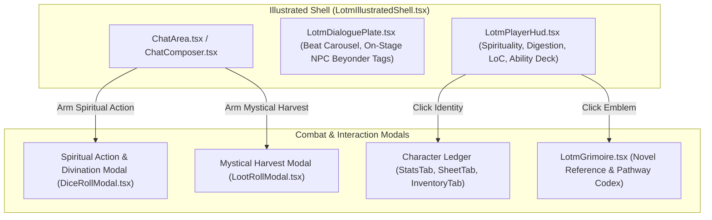

# LOTM UI & Combat HUD Restructuring Spec

- **Audience:** Frontend UI and component engineering agents implementing or updating player-facing screens, HUDs, modals, and composer widgets for Lord of the Mysteries gameplay.
- **Goal:** Restructure all combat, dice, and loot UI surfaces to reflect Victorian occult immersion, removing D&D terminology (HP, AC, Spell Slots, generic D20 gates) in favor of Sequence tiers, Spirituality meters, Loss of Control warnings, Sealed Artifact downside badges, and Loen monetary summaries.
- **Sister docs:**
  - [gameplay-runtime.md](./gameplay-runtime.md) — chronicle host runtime.
  - [lotm-combat-system.md](./lotm-combat-system.md) — in-world combat mechanics.
  - [lotm-loot-and-artifacts.md](./lotm-loot-and-artifacts.md) — loot, characteristics, and Sealed Artifacts.

---

## 1. UI Surface Restructuring Overview

---

## 2. Restructuring the Action Modal (`DiceRollModal.tsx`)

The current `DiceRollModal.tsx` exposes generic 3-gate D&D-style controls ("Gate 1: Modifier", "Gate 2: Dice Count", "Gate 3: Aggregation"). It must be restructured into the **Spiritual Action & Divination Modal**.

### 2.1 Visual & Functional Requirements
1. **Modal Header:**
   - Label: `Spiritual Action & Divination` (with mystical astrolabe / tarot icon).
2. **Engine Sequence Band Indicator:**
   - Display the engine-computed Sequence tier calculated by `resolveSequenceAdvantage`:
     - *Advantage:* `[Advantage: Sequence 9 vs Mundanes]` (Golden text).
     - *Normal:* `[Normal: Sequence 8 vs Sequence 8]` (Muted terminal text).
     - *Disadvantage:* `[Disadvantage: Spiritually Spent / Outmatched]` (Crimson text).
3. **Action Intent Category:**
   - Quick-select domain buttons:
     - `Beyonder Ability`: Channeling a pathway sequence power.
     - `Divination / Astromancy`: Dowsing rod, dream revelation, pendulum.
     - `Spirit Vision`: Aura and spiritual body observation.
     - `Ritual Magic`: Creating spirituality walls, deity prayers, summoning.
     - `Physical / Mundane`: Victorian revolver shot, sprint, street brawl.
4. **Spirituality & Loss of Control Preview:**
   - Explicit cost line: `-1 Spirituality on commitment` (shows `Current / Max -> Projected`).
   - If Spirituality $\le 0$: Render warning badge: `⚠️ Critical Fatigue: Acting at 0 SPI will advance Loss of Control to the next stage!`
   - If Loss of Control $\ge 2$: Render warning badge: `⚠️ Unstable Spirit: Severe slippage forces Disadvantage on all outcomes.`
5. **Action Confirmation Button:**
   - Label: `Arm Spiritual Action` (dispatches `setArmedRoll`).

---

## 3. Restructuring the Loot Modal (`LootRollModal.tsx`)

The current `LootRollModal.tsx` must be styled as the **Mystical Harvest & Spoils Modal**.

### 3.1 Visual & Functional Requirements
1. **Modal Header:**
   - Label: `Mystical Harvest & Spoils`.
2. **Category Selection (`labelLotmLootCategory`):**
   - Checkbox list with authentic in-world categories:
     - `Extraordinary Ingredients & Characteristics`
     - `Potion Formulas`
     - `Sealed Artifacts & Beyonder Weapons`
     - `Loen Currency (Pounds / Soli / Pence)`
     - `Medicine & Calming Tonics`
     - `Church & Police Hunt Contracts`
     - `Ordinary Victorian Goods`
3. **Quantity Selector:**
   - 1 to 9 items to harvest/search from the scene.
4. **Convergence Lore Banner:**
   - Subtle prompt: `"Precipitated characteristics and extraordinary items obey the Law of Convergence. High-grade spoils may draw unwanted church attention."`
5. **Confirmation Button:**
   - Label: `Arm Mystical Harvest` (dispatches `armLoot`).

---

## 4. Player HUD Enhancements (`LotmPlayerHud.tsx`)

The HUD sits permanently in the Illustrated Shell and must serve as the primary Beyonder status monitor.

### 4.1 HUD Components & Layout
1. **Identity & Pathway Emblem:**
   - High-resolution pathway symbol (`gamedata/assets/data/pathways/*/Symbol2.webp`).
   - Clicking emblem opens the pathway page in the Grimoire (`openGrimoire({ section: 'pathways', id })`).
   - Character Name + `[Pathway Name · Sequence N SequenceName]`.
2. **Spirituality Meter (`Meter tone="spi"`):**
   - Primary resource bar displaying `current / max` spirituality.
   - Low spirituality state ($\le 30\%$) triggers an ethereal blue pulse.
3. **Loss of Control Stage Meter / Indicator:**
   - Four discrete stage indicators:
     - `Stage 0 (Stable)`: Muted slate indicator.
     - `Stage 1 (Tells)`: Subtle amber glow (`"Whispers & distorted sensations"`).
     - `Stage 2 (Slippage)`: Vivid purple/crimson warning (`"Physical mutations & uncontrolled misfires"`).
     - `Stage 3 (Rampage)`: Pulsing crimson hazard (`"Full Mythical Creature Rampage — Containment Imminent"`).
4. **Sequence Abilities Quick Deck:**
   - Expandable horizontal strip displaying the 3-8 abilities available for the current Sequence (`abilitiesForLotmCompendium`).
   - Hovering/clicking an ability displays its name, cost (e.g. `1 SPI`), and description preview from `lotmAbilityCompendium.ts`.
5. **Digestion & Advancement Meter (`Meter tone="dig"`):**
   - Percentage meter showing $0\%$ to $100\%$ digestion.
   - When $100\%$ is reached, highlights the advancement readiness with an amber border.
6. **Purse Summary:**
   - Displays carried coins formatted via `formatLotmPurseLine` (e.g. `\pounds 3 · 12s · 4d`).
7. **Active Sealed Artifact Downside Badges:**
   - If an equipped item has a known downside (e.g. `3-1328 Eye of Crystal`), displays a warning badge indicating the active penalty.

---

## 5. Dialogue Plate & Scene Stage Integration (`LotmDialoguePlate.tsx`)

1. **On-Stage Beyonder Badges:**
   - For every active NPC present on stage (`onStageNpcIds`), display their known Pathway and Sequence badge beside their portrait (e.g. `[Leonard Mitchell · Seq 8 Midnight Poet]`).
2. **Social Standing Display:**
   - Surface NPC Standing as descriptive bands (`standingWordForNpc`), such as *Devoted*, *Friendly*, *Neutral*, *Cold*, *Hostile*, or *Vendetta* — never showing raw numbers ($-3 \dots +3$).
3. **Spirit Vision Filter (Visual Mode):**
   - Optional toggle allowing the player to view the current scene in "Spirit Vision" mode (adding ethereal color auras representing NPC emotional states and mystical residues).

---

## 6. Character Ledger Updates (`StatsTab.tsx` & `InventoryTab.tsx`)

1. **Stats Tab:**
   - Displays Pathway, Sequence, Spirit Meter, Physique, Reasoning, and Acting Method creed.
   - **Potion Advancement Section:**
     - Displays current and next sequence potion art (`gamedata/assets/data/pathways/*/potions/*.webp`).
     - Shows Main and Supplementary formula ingredients.
     - Houses the **"Consume Potion & Advance"** button, strictly gated by `digestion === 100` (`commitLotmPotionDrink`).
2. **Inventory Tab:**
   - Groups items under Loen categories: Currency, Consumables/Medicines, Beyonder Weapons, Sealed Artifacts, Ingredients, and Documents/Formulas.
   - Shows detailed downside/flaw descriptions on all Sealed Artifact cards.
   - Shows total purse balance at the top of the inventory.

---

## 7. Component File Reference Matrix

| Component Surface | Source File Path | Primary Responsibilities |
|---|---|---|
| **Illustrated Shell** | `src/components/lotm/LotmIllustratedShell.tsx` | Layout container for HUD, Dialogue, Stage, and Chat |
| **Player HUD** | `src/components/lotm/LotmPlayerHud.tsx` | Spirituality meter, LoC indicator, Digestion %, Ability Deck |
| **HUD View Model** | `src/components/lotm/lotmPlayerHudModel.ts` | Data transformation for HUD presentation |
| **Dialogue Plate** | `src/components/lotm/LotmDialoguePlate.tsx` | GM beat carousel, location nameplate, on-stage NPC badges |
| **Action Modal** | `src/components/chat/DiceRollModal.tsx` | Beyonder action arming, Sequence tier preview, SPI cost warning |
| **Loot Modal** | `src/components/chat/LootRollModal.tsx` | Mystical spoils arming, category checkboxes, convergence info |
| **Stats Tab** | `src/components/character/tabs/StatsTab.tsx` | Beyonder stats, Acting Method, Potion advancement button |
| **Inventory Tab** | `src/components/character/tabs/InventoryTab.tsx` | Categorized Loen inventory, purse summary, artifact flaw cards |
| **Grimoire** | `src/components/lotm/LotmGrimoire.tsx` | Pathway reference, Orthodox Churches, World geography |
