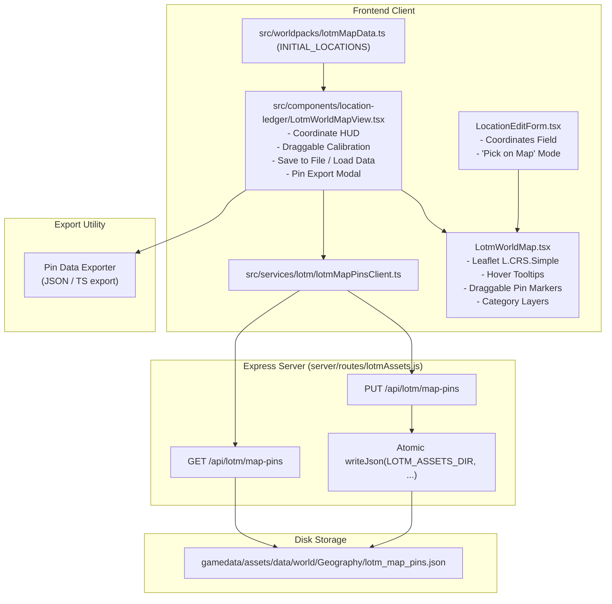

# LOTM World Map Pins Calibration, Manual Pin Editor & Export Architecture

- **Audience:** Frontend UI engineers, Game Master tool designers, and AI agents maintaining the Lord of the Mysteries (LOTM) world map, location ledger, and pin placement workflows in Narrative Engine Desktop.
- **Goal:** Document the interactive map coordinate system, lore pin taxonomy, draggable marker calibration workflow, backend JSON file persistence, and pin data export capabilities.
- **Sister docs:**
  - [lotm-player-and-lore-grimoires.md](./lotm-player-and-lore-grimoires.md) — Player & World Lore Grimoire architecture.
  - [lotm-how-to-play-guide.md](./lotm-how-to-play-guide.md) — Gameplay guide and GM tools.
  - [ui-view-modes.md](./ui-view-modes.md) — Player vs Game Master view mode gating.

---

## 1. Overview & Architectural Data Flow

The world map subsystem provides an interactive cartographic interface for both the **Game Master Location Ledger Modal** (`LocationLedgerModal.tsx`) and the **Player Grimoire** (`LotmPlayerGrimoire.tsx`).

The architecture consists of:
1. **Surveyed Canon Map Data (`lotmMapData.ts` & `lotm_map_pins.json`)**: Sourced directly from `gamedata/assets/data/world/Geography/lotm_map_pins.json` with all canonical regions, cities, harbors, and sea boundaries.
2. **Campaign Location Ledger Store (`campaignSlice.ts`)**: Stores live `LocationEntry` records, including custom calibrated `coordinates: [lat, lng]`.
3. **Interactive Leaflet Surface (`LotmWorldMap.tsx`)**: Renders raster map overlays (`7400 x 3800` px) with `L.CRS.Simple`, category-colored pin markers, coordinate HUD readouts, hover tooltips, and draggable markers in calibration mode.
4. **GM Calibration & File Persistence Tools (`LotmWorldMapView.tsx`, `lotmMapPinsClient.ts`, `server/routes/lotmAssets.js`)**: Allows GM users to drag pins directly on the map, click **Save to File** to write calibrated positions atomically back to `lotm_map_pins.json` on disk, click **Load Data** to reload from disk, and export pin definitions as JSON or TypeScript.

---

## 2. Coordinate System Specification

### 2.1 Leaflet Coordinate Space
The LOTM world map image (`Lotm_World_Map.webp`) has dimensions of **7400 pixels width by 3800 pixels height**.

In Leaflet's `L.CRS.Simple` planar projection:
- **X-axis (Longitude):** Ranges from `0` (far west / Fog Sea) to `7400` (far east / Forsaken Land of the Gods).
- **Y-axis (Latitude):** Ranges from `-3800` (far south / Southern Continent & Abyss) to `0` (far north / Northern Feysac).
- **Bounds:** `[[-3800, 0], [0, 7400]]`.
- **Coordinate Tuple:** `[lat, lng]` represented in code as `[-y, x]`.

### 2.2 Standard Region Anchors
| Region / Landmark | Representative `[lat, lng]` | Description |
|---|---|---|
| **Backlund (Loen)** | `[-1100, 3900]` | Central capital of the Loen Kingdom |
| **Trier (Intis)** | `[-1120, 3440]` | Capital of the Intis Republic |
| **Feynapotter City** | `[-1350, 3300]` | Capital of Feynapotter |
| **St. Millom (Feysac)** | `[-650, 3700]` | Northern imperial capital of Feysac |
| **Bayam (Rorsted)** | `[-1650, 4550]` | Sonia Sea archipelago port capital |
| **City of Silver** | `[-1200, 6200]` | Ancient sanctuary in Forsaken Land |
| **Giant King's Court** | `[-1100, 6000]` | Ruined divine palace of Second Epoch |
| **West Balam** | `[-2200, 3900]` | Tropical western Southern Continent |
| **East Balam** | `[-2300, 4300]` | Eastern colonial Southern Continent |

---

## 3. Map Pin Taxonomy & Layers

Pin icons are styled as circular glowing markers categorized by `LotmMapPinType`:

| Pin Type | Hex Color | Category Layer | Usage |
|---|---|---|---|
| `nation` / `region` | `#f97316` (Orange) / `#eab308` (Yellow) | `Kingdoms` | Nations, empires, and broad territorial regions |
| `city` | `#ef4444` (Red) | `Cities` | Major metropolises and capital cities |
| `harbor` | `#14b8a6` (Teal) | `Cities` | Seaports, naval yards, and coastal harbor towns |
| `village` | `#fb7185` (Rose) | `Cities` | Mountain settlements and rural villages |
| `landmark` | `#a855f7` (Purple) | `Cities` / `Kingdoms` | Ancient ruins, divine palaces, and bays |
| `sea` | `#3b82f6` (Blue) | `Seas` | Oceans, seas, and maritime corridors |

Layers in the map viewer are streamlined cleanly to `Kingdoms`, `Cities`, and `Seas`. All static novel paths or extraneous route overlays have been removed so focus remains strictly on geography and location pins.

On hover, each pin presents an instant tooltip showing the location's name and category/details metadata. Pins maintain a `pointer` cursor across all modes (normal and calibration).

---

## 4. Draggable Pin Calibration Workflow & Disk Sync

In **Calibration Mode**, pin markers become directly draggable interactive objects:

1. **Activating Calibration Mode:**
   - Click the **Calibrate** button in the map toolbar.
   - The map pins switch to `draggable: true` while retaining the `pointer` cursor and hover details.
   - An informative top banner confirms: *"Calibration Mode Active: Drag any pin to reposition its coordinates"*.
2. **Dragging Pins on the Map:**
   - Clicking and dragging any pin moves the pin across the map rather than panning the map canvas.
   - On release (`dragend`), the pin's new position `[lat, lng]` is rounded to the nearest integer coordinates.
   - The new coordinates immediately update the live map state, sync with the campaign store (`updateLocation`), and feed into the pin exporter.
3. **Save to File (Backend Persistence):**
   - Click **Save to File** in the top-right toolbar.
   - Dispatches a `PUT /api/lotm/map-pins` request to atomically overwrite `lotm_map_pins.json` on disk.
4. **Load Data (Backend Sync):**
   - Click **Load Data** to re-fetch the latest pins from `GET /api/lotm/map-pins` and refresh the canvas.
5. **Pick on Map in Place Details:**
   - In `LocationEditForm.tsx`, clicking **Pick on Map** arms a single-target coordinate picker.
   - Clicking anywhere on the map or dragging a pin assigns the exact coordinates to the form.

---

## 5. Pin Data Export & Persistence

The map interface provides an **Export Pins** tool:
- **Export Formats:**
  - Standard JSON (`lotm_map_pins.json`) containing all `LotmMapPin` entries.
  - TypeScript code snippet formatted for direct inclusion in `src/worldpacks/lotmMapData.ts`.
- **Copy & Download:**
  - One-click copy to system clipboard.
  - Direct file download for archiving and sharing across campaigns.

---

## 6. Read-Only Map Embedding in Grimoires

`LotmWorldMapView` supports a `readOnly?: boolean` prop that adapts the map for player-facing and reference overlays:
- **Game Master Full View (`readOnly={false}` in `LocationLedgerModal.tsx`)**:
  - Full access to calibration toolbar (`Save to File`, `Load Data`, `Calibrate`, `Export Pins`).
  - Live cursor coordinates HUD in top-left.
  - Draggable pins in calibration mode and interactive coordinate picking.
- **Read-Only Informational View (`readOnly={true}` in `LotmPlayerGrimoire.tsx` and `LotmGrimoire.tsx`)**:
  - Hides all GM action toolbars, calibration overlays, and cursor HUDs.
  - Maintains full interactive cartography: hover tooltips, pin selection (`onSelectName`), destination highlighting (`highlightCoords`), and category layer toggles (`Kingdoms`, `Cities`, `Seas`).
  - Embedded under *Location & Travel* in `LotmPlayerGrimoire` and *World -> Geography* in `LotmGrimoire`.

