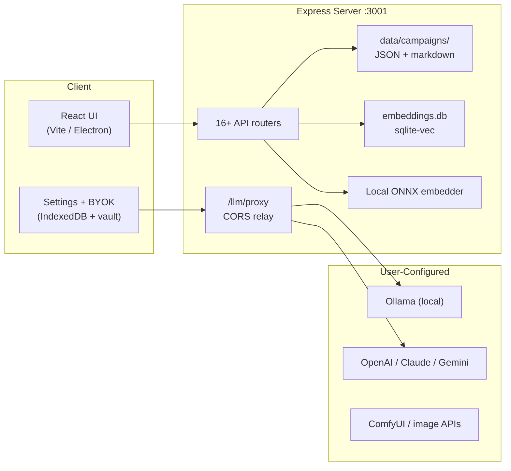

# Monetization & Deployment Guide

- **Audience:** Developers, operators, and AI agents evaluating how to ship and monetize Narrative Engine / LOTM.
- **Goal:** Compare revenue models against the app's real architecture — not generic SaaS advice.
- **Sister docs:**
  - [COOLIFY.md](../COOLIFY.md) — VPS deployment, Coolify setup, and production env vars.
  - [README.md](../../README.md) — Getting started, platform overview, and positioning.
  - [AI_CODEBASE_MAP.md](../../AI_CODEBASE_MAP.md) — Module boundaries, data flows, and blast-radius matrix.

---

## 1. How the Application Works (Monetization-Relevant Summary)

Narrative Engine is a **local-first, BYOK (bring-your-own-key) TTRPG engine**. Campaign data lives on disk; LLM and image calls go to providers the user configures. There is no login, billing, or multi-tenant isolation in the codebase today.

### Architecture facts and monetization implications

| Property | Implication for monetization |
|---|---|
| **BYOK** — users configure their own LLM/image providers ([`src/types/llm.ts`](../../src/types/llm.ts), [`server/routes/llmProxy.js`](../../server/routes/llmProxy.js)) | You do not control inference cost today; usage billing requires a proxy/billing layer |
| **Local-first data** — campaigns in `data/campaigns/`, vectors in `data/embeddings.db` ([`server/lib/fileStore.js`](../../server/lib/fileStore.js)) | Strong privacy pitch; no multi-tenant isolation exists |
| **No auth / no billing** — no login, Stripe, or license gates anywhere | Every paid model is greenfield engineering |
| **MIT license** ([`LICENSE`](../../LICENSE)) | Engine can be sold, forked, sublicensed |
| **LOTM fan content** (`mechanics/`, `gamedata/`) | Separate IP risk from the MIT engine — commercial LOTM branding needs rights clearance |
| **Existing deploy path** — Docker + Coolify + GHCR ([`Dockerfile`](../../Dockerfile), [`.github/workflows/deploy.yml`](../../.github/workflows/deploy.yml), [`docs/COOLIFY.md`](../COOLIFY.md)) | Hosted SaaS is the lowest-friction path to a public URL |
| **Desktop path** — `start.sh` / `.bat`, Electron hooks in [`src/lib/apiBase.ts`](../../src/lib/apiBase.ts) but `electron/` is gitignored | Download sale needs a packaging pipeline (not in repo today) |
| **Mobile companion** — separate [NarrativeEngine-M](https://github.com/Sagesheep/NarrativeEngine-M) repo | Mobile IAP is a separate product surface |

---

## 2. Operator Cost Baseline

Before choosing a revenue model, document what running the app actually costs:

| Cost | Details |
|---|---|
| **VPS** | 2 GB RAM minimum, 4 GB with Chatterbox TTS ([`docs/COOLIFY.md`](../COOLIFY.md) §4) |
| **First deploy** | ONNX embedder download into `data/.embeddings_cache` on first embedder warmup |
| **LLM cost** | Borne by end user (BYOK) unless the operator bundles credits |
| **CI** | GitHub Actions builds native `better-sqlite3` image — the VPS does not compile native modules. See [docker-build-performance.md](./docker-build-performance.md) for build timing and cache tuning. |

---

## 3. Revenue Models

For each model: **fit**, **how it maps to the app**, **what to build**, **example pricing**, and **risks**.

### Model A — One-time download sale (desktop)

- **Fit:** Strong. App is designed for local-first play; README already ships `Start_Narrative_Engine.bat` / `start.sh`.
- **How it works today:** User clones or downloads, runs Node locally, data stays in `data/`.
- **What to build:**
  - Electron packaging pipeline (hooks exist; `electron/` not in repo)
  - Code signing (Windows/macOS)
  - Distribution: itch.io, Gumroad, Steam, direct site
  - Optional: license key / activation (greenfield)
- **Pricing examples:** $15–40 one-time for engine; $25–50 for LOTM edition (if IP cleared).
- **Risks:** Users still need their own LLM API or Ollama; support burden for Node/native module issues (`better-sqlite3`).

### Model B — Hosted instance (flat subscription / per-seat)

- **Fit:** Technically feasible. [`docker-compose.yml`](../../docker-compose.yml) + Coolify already deploy to `lotmdnd.work.gd`.
- **How it works:** Operator runs one Docker container per customer (or shared instance — see risks).
- **What to build:**
  - Per-tenant auth (OAuth, magic link, or invite codes)
  - Per-tenant `DATA_DIR` volume isolation
  - Billing: Stripe Checkout + webhook → provision/revoke instance
  - Onboarding: pre-configured Ollama sidecar or bundled API key pool
- **Pricing examples:** $8–15/mo hobby, $25–50/mo group (4 seats), $100+/mo dedicated VPS.
- **Risks:** Shared-instance multi-tenancy is **not** in the codebase — one container = one logical customer is safest. Long LLM streams need 300s+ proxy timeout (Coolify §6).

### Model C — Usage-based billing (per turn / per token)

- **Fit:** Requires significant new infrastructure. Today LLM calls go direct from browser → [`llmFetch.ts`](../../src/services/llm/llmFetch.ts) → user provider (or via [`/llm/proxy`](../../server/routes/llmProxy.js) for CORS only).
- **How it would work:**
  - Operator becomes the LLM provider: proxy all calls through server, meter tokens/turns
  - Track usage in new DB table; enforce quotas before [`turnOrchestrator.ts`](../../src/services/turn/turnOrchestrator.ts) runs
  - `aiTier` ([`src/services/turn/aiTier.ts`](../../src/services/turn/aiTier.ts)) already gates background AI stages — could become a paid tier gate
- **Pricing examples:** $0.02–0.10 per turn, or token markup on wholesale API cost.
- **Risks:** Margin depends on LLM wholesale pricing; users may prefer BYOK to avoid markup; must handle streaming, retries, and provider failover.

### Model D — Sell engine license / white-label (B2B)

- **Fit:** Strong under MIT. [`packages/engine`](../../packages/engine) is platform-pure shared core.
- **How it works:** Sell rebranded deployment to TTRPG studios, actual-play podcasts, or LARP groups.
- **What to build:** Branding layer, deployment runbook, optional SLA/support contract. No code changes strictly required.
- **Pricing examples:** $500–5,000 setup + $100–500/mo managed hosting.
- **Risks:** Buyer expects auth, backups, and support — operational, not code.

### Model E — Content / mod marketplace

- **Fit:** Partial foundation. Mod system exists (`mods/`, Extensions tab in Settings); world packs in `mechanics/` and `gamedata/`.
- **What to build:** Mod signing, marketplace UI, payment rails (Stripe Connect or platform fee), DRM optional.
- **Pricing examples:** $5–20 per campaign pack; 70/30 creator split.
- **Risks:** LOTM-specific packs face same IP issue; engine mods are easier to sell than fan-fiction content.

### Model F — Freemium (free engine + paid LOTM / premium features)

- **Fit:** Requires feature gates not present today.
- **How it works:** Ship base Narrative Engine free (MIT); gate LOTM mechanics, map engine, or `aiTier=max` behind paywall.
- **What to build:** License check, feature flags, in-app purchase or key redemption.
- **Pricing examples:** Free base + $20 LOTM DLC unlock.
- **Risks:** Open-source MIT means anyone can fork and remove gates; gating works better for hosted SaaS than downloadable source.

### Model G — Managed AI bundle ("we include the LLM")

- **Fit:** Natural upsell on hosted Model B or C.
- **How it works:** Operator stores a pooled API key in server vault ([`server/vault.js`](../../server/vault.js)); injects provider config per tenant instead of BYOK.
- **What to build:** Key pool rotation, per-user quota, cost monitoring, fallback to BYOK when quota exhausted.
- **Pricing examples:** $15/mo includes 500 turns; overage $0.05/turn.
- **Risks:** Abuse, key leakage, provider ToS on reselling API access.

### Model H — Support, deployment, and consulting

- **Fit:** Zero code changes. Document Coolify setup, Ollama tuning, campaign migration.
- **Pricing examples:** $200–1,000 one-time setup; $50/hr support retainer.
- **Risks:** Low scale; good bootstrap revenue while building Models B/C.

### Model I — Community / donation (Patreon, Ko-fi, Discord Nitro perks)

- **Fit:** Immediate. README already links Discord.
- **What to build:** Early-access builds, supporter-only mods, naming in credits.
- **Risks:** Not scalable alone; pairs well with any other model.

---

## 4. Decision Matrix

| Model | Revenue potential | Build effort | Recurring revenue | Fits BYOK architecture | IP risk (LOTM) |
|---|---|---|---|---|---|
| Download sale | Medium | Medium | No | Excellent | High if branded |
| Hosted SaaS | High | High | Yes | Good (needs auth) | Medium |
| Usage billing | High | Very high | Yes | Poor (conflicts with BYOK) | Medium |
| White-label B2B | High | Low–Medium | Yes | Excellent | Low (engine only) |
| Mod marketplace | Medium | High | Yes | Good | Varies |
| Freemium | Medium | Medium | Partial | Poor (MIT fork) | High |
| Managed AI bundle | High | High | Yes | Moderate | Medium |
| Consulting | Low | None | Partial | Excellent | Low |
| Donations | Low | None | Yes | Excellent | Low |

---

## 5. Recommended Paths (by Stage)

| Stage | Focus |
|---|---|
| **Stage 0 (now)** | Donations + consulting using existing Coolify deploy |
| **Stage 1** | One-time download (engine-only, no LOTM branding) via Gumroad/itch.io + Electron build |
| **Stage 2** | Hosted SaaS — one Docker container per paying group, Stripe billing, optional managed AI bundle |
| **Stage 3** | Usage metering + marketplace once auth and tenancy exist |

---

## 6. Legal and Compliance Checklist

- **MIT license** allows commercial sale of the **engine** — no royalties required to upstream.
- **LOTM content** (`mechanics/World_compendium/`, `gamedata/`) — flag as fan content; commercial sale likely needs separate licensing or an engine-only SKU.
- **GDPR/privacy:** Local-first is a selling point; hosted SaaS needs privacy policy, data retention, and export ([`server/routes/transfer.js`](../../server/routes/transfer.js) already supports campaign export).
- **API provider ToS:** Reselling OpenAI/Anthropic access may violate terms — check each provider before Model G.
- **Payment compliance:** Stripe handles PCI; no card data in app.

> This section flags risks for planning purposes. It is not legal advice.

---

## 7. Implementation Pointers (for Agents)

Short "where to wire" references for the most common greenfield work:

| Feature needed | Likely touch points |
|---|---|
| Auth | New `server/routes/auth.js`, middleware in [`server.js`](../../server.js), login UI |
| Billing | Stripe webhook route, `data/subscriptions.json` or DB |
| Usage metering | Wrap [`llmService.ts`](../../src/services/llm/llmService.ts) / [`llmProxy.js`](../../server/routes/llmProxy.js), log to SQLite |
| License gate | [`settingsSlice.ts`](../../src/store/slices/settingsSlice.ts) or startup check in [`App.tsx`](../../src/App.tsx) |
| Per-tenant hosting | Duplicate Coolify resource per customer; env `DATA_DIR` on separate volume |
| Electron packaging | New `electron/` directory, `electron-builder` in `package.json` |

---

## 8. What NOT to Do

- Do not promise "no subscription" ([`README.md`](../../README.md) line 12) while launching a subscription without updating positioning.
- Do not run multi-tenant on one `data/` volume without auth — campaigns are unencrypted JSON.
- Do not bundle LOTM-branded commercial product without IP review.
- Do not resell cloud LLM access without verifying provider terms of service.

---

## 9. Out of Scope for This Guide

- Implementing billing, auth, or packaging (documentation only)
- Legal advice (risks are flagged; outcomes are not prescribed)
- Mobile app monetization details — see [NarrativeEngine-M](https://github.com/Sagesheep/NarrativeEngine-M) as a separate product surface
