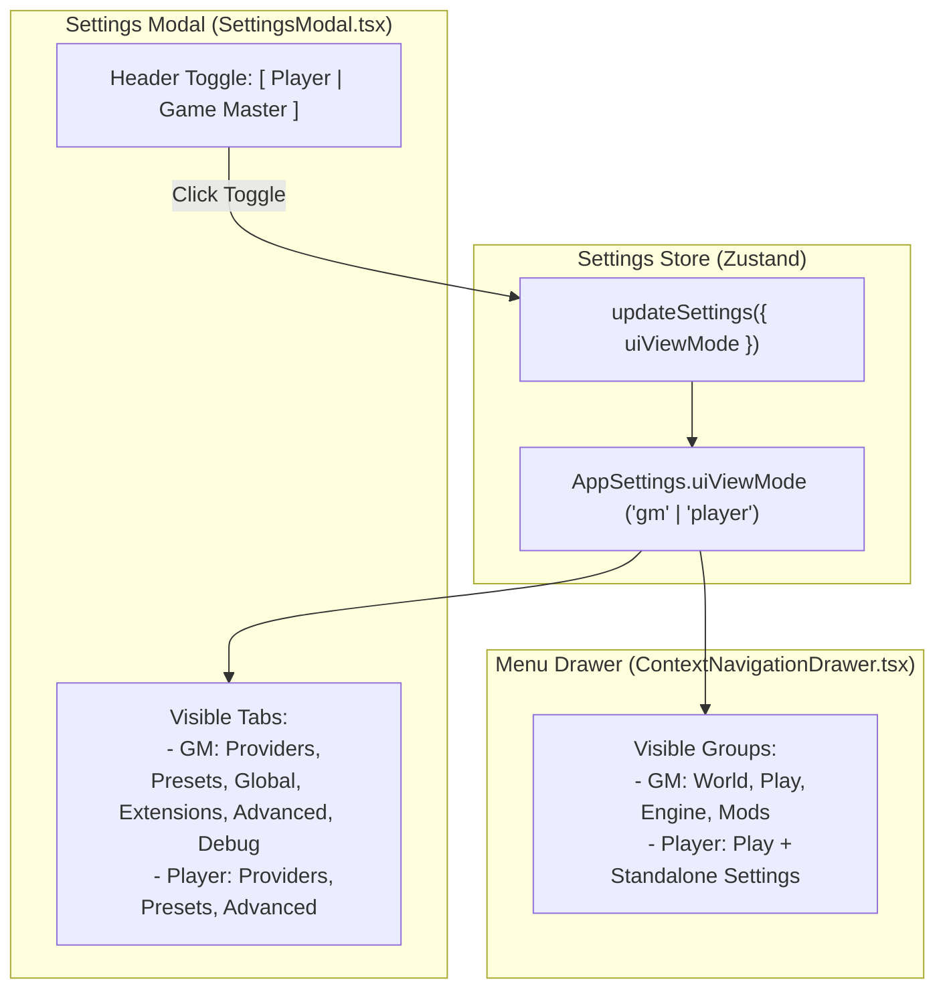

# UI View Modes: Player and Game Master Modes

- **Audience:** Frontend and UI engineering agents implementing or maintaining player-facing navigation, menu chrome, settings dialogs, and permission/view mode toggling in Narrative Engine / LOTM Desktop.
- **Goal:** Provide a clear architectural specification and reference for the UI view mode split between 'Player' and 'Game Master' (GM) modes.
- **Sister docs:**
  - [gameplay-runtime.md](./gameplay-runtime.md) — Chronicle host runtime.
  - [lotm-ui-combat-restructuring.md](./lotm-ui-combat-restructuring.md) — LOTM UI and player HUD restructuring.

---

## 1. Overview & Architectural Data Flow

The view mode architecture bifurcates the desktop UI into two distinct roles:
1. **Game Master (GM) Mode (Default):** The full developer/game-master interface, exposing world ledgers, engine tuning, rules editors, diagnostics, extensions, and debug tabs.
2. **Player Mode:** A streamlined, immersion-first interface hiding world, engine, and mod customization controls from the side navigation menu, and restricting Settings to essential provider and preset configuration.



---

## 2. State & Storage Contract

### 2.1 Types (`src/types/llm.ts`)
```ts
export type UIViewMode = 'gm' | 'player';

export type AppSettings = {
    // ...
    uiViewMode?: UIViewMode;
    // ...
};
```

### 2.2 Store & Persistence (`src/store/slices/settingsHelpers.ts`)
- **Default State:** `defaultSettings.uiViewMode = 'gm'`.
- **Migration:** `migrateSettings(raw)` falls back to `'gm'` if `raw.uiViewMode` is missing or not `'player'`.
- **Persistence:** Saved in `idb-keyval` under `'nn_settings'` and synced to server `/settings` via `debouncedSaveSettings`.

---

## 3. UI Component Implementations

### 3.1 Settings Modal (`src/components/SettingsModal.tsx`)
- **Header View Switcher:** Mounted in `ScreenLightbox`'s `headerRight` slot.
  ```tsx
  <div role="group" aria-label={t('settings.viewMode.label')}>
      <button onClick={() => updateSettings({ uiViewMode: 'player' })}>Player</button>
      <button onClick={() => updateSettings({ uiViewMode: 'gm' })}>Game Master</button>
  </div>
  ```
- **Tab Gating:**
  - `PLAYER_TAB_KEYS: readonly TabKey[] = ['providers', 'presets', 'advanced']`.
  - In `'player'` mode, `TABS` is filtered to only include `PLAYER_TAB_KEYS`.
  - If an excluded tab (`global`, `extensions`, `debug`) was active when switching to `'player'`, `effectiveTab` safely falls back to `'providers'`.

### 3.2 Navigation Menu Drawer (`src/components/ContextNavigationDrawer.tsx`)
- **Group Gating:**
  - In `'player'` mode, `GROUPS` filters out `world`, `engine`, `mods`, and `story`.
  - Only `play` remains active in the accordion list.
- **Settings Exception:**
  - Because `engine` is hidden in Player view (which previously contained the Settings launcher in LOTM mode), a dedicated `Settings` item is rendered directly in the drawer for Player mode:
    ```tsx
    {uiViewMode === 'player' && (
        <div className="my-1 border-t border-border/60 pt-1">
            <NavRow leaf={{ id: 'settings', label: 'Settings', icon: Settings, onSelect: () => useAppStore.getState().toggleSettings() }} />
        </div>
    )}
    ```

---

## 4. Key Files & Reference Table

| Path | Role | Key Functions / Elements |
|---|---|---|
| `src/types/llm.ts` | Type definition | `UIViewMode`, `AppSettings.uiViewMode` |
| `src/store/slices/settingsHelpers.ts` | Default state & migration | `defaultSettings`, `migrateSettings` |
| `src/components/SettingsModal.tsx` | View switcher & tab restriction | `PLAYER_TAB_KEYS`, `viewModeHeader`, `visibleTabs` |
| `src/components/ContextNavigationDrawer.tsx` | Menu group visibility filtering | `uiViewMode` filter on `GROUPS`, Player `Settings` row |
| `src/i18n/locales/en.ts` | Internationalization | `settings.viewMode.player`, `settings.viewMode.gm`, `settings.viewMode.label` |

---

## 5. Test Coverage & Verification

Unit and integration tests are co-located in:
- `src/components/__tests__/SettingsModal.test.tsx`:
  - Validates default `'gm'` view mode rendering all 6 tabs.
  - Validates switching to `'player'` mode restricting tabs to Providers, Presets, and Advanced.
  - Validates active tab fallback to `'providers'` when an excluded tab is active during toggle.
  - Validates switching back from `'player'` to `'gm'`.
- `src/components/__tests__/ContextNavigationDrawer.test.tsx`:
  - Validates `'gm'` mode showing all groups (`World`, `Play`, `Engine`).
  - Validates `'player'` mode hiding `World`, `Engine`, and `Mods` while displaying `Play` and `Settings`.
